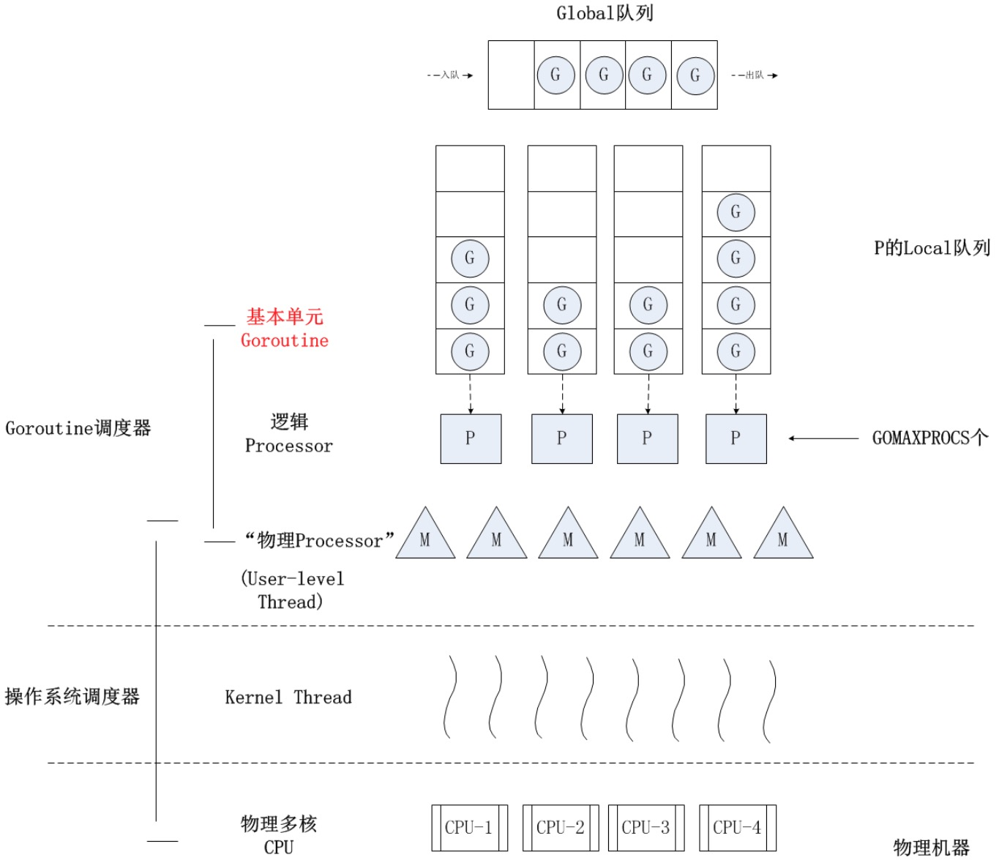

### 内核线程、用户线程

__内核线程__
* 内核线程 -> CPU

* 其实等同于单线程的进程, pthread clone创建的就是内核线程

* 内核线程的调度由操作系统负责, 一个内核线程处于阻塞状态时不影响其他的内核线程, 因为其是调度的基本单位

* 所有线程最终都必须有内核线程来执行

* 这些线程可以在全系统内进行资源的竞争

__用户线程__

* 用户线程 -> 内核线程 -> CPU

* 不需要内核支持而在用户程序中实现的线程, 其不依赖于操作系统核心, 进程利用线程库提供创建、同步、调度和管理线程的函数来控制用户线程

* 内核资源的分配仍然是按照进程进行分配的, 各个用户线程只能在进程内进行资源竞争

* 用户线程必须映射到具体的内核线程来执行, 当线程进行切换的时候, 由用户态转化为内核态, 切换完毕要从内核态返回用户态, 即存在用户态和内核态之间的转换

* 用户线程有多中模型, 1:1、N:1、N:M

* 我们平时说的多线程、轻量级进程、协程、goroutine其实都属于用户线程, 因为他都属于用户态的

* 由于c/c++/java都是1:1的模型, 是一种轻量级进程, 所以我们一般称为多线程; lua是N:1模型、golang是N:M的模型, 我们新起了一个名字叫协程

__轻量级进程__
* LWP - Light Weight Process, 其实就是平时说的多线程的那个线程

* 轻量级进程 -> 内核线程 -> CPU

* pthread_create创建的就是轻量级线程, sun公司开发的 HotSpot JDK 1.8 创建的线程也是轻量级进程, 即1:1模型的.

* 由于每个LWP都与一个特定的内核线程关联, 因此每个LWP都是一个独立的线程调度单元. 即使有一个LWP在系统调用中阻塞, 也不会影响整个进程的执行

* 优点是在多处理器系统中, 内核能够同时调度同一进程中多个线程并行执行到多个处理器中; 如果进程中的一个线程被阻塞, 内核可以调度同一个进程中的另一个线程

* 缺点是即使CPU在同一个进程的多个线程之间切换, 也需要陷入内核, 因此其速度和效率不如用户级线程

__协程__
* coroutine, 也就是轻量级的线程

* 用户线程 -> 调度器 -> 内核线程 -> CPU

* lua, N:1模型

* goroutine 只不过是N:M的模型

* 用户级线程内核的切换由用户态程序自己控制(通过系统调用来获得内核提供的服务), 不需要内核干涉, 少了进出内核态的消耗

* 内核资源的分配仍然是按照进程进行分配的, 各个用户线程只能在进程内进行资源竞争  

* 优点是线程的切换无需陷入内核, 故切换开销小, 速度非常快

__用户线程 和 内核线程 的关系 及映射模型__

* 1:1 模型  
  * 一个用户线程就只在一个内核线程上跑, 这时可以利用多核, 进程中的一个线程阻塞, 其他线程还可以运行. 但是上下文switch很慢, 因为他要陷入内核态.  

  * 这种用户线程就是轻量级进程(LWP-light weight process)

  * pthread, java sun开发的sdk 都是这种

* N:1 模型  
  * 多对一的模型将多个用户线程映射到一个内核线程. 多对一模型线程的切换速度要快很多, 他不需要内核态的切换(线程之间的切换由用户代码来执行). 这种模型中, 进程中的某个线程被阻塞, 比如io等待, 那么整个进程都会被阻塞.  

  * 每个用户线程并不具有自身的线程上下文, 因此就线程的同时执行而言, 任意给定时刻每个进程只能够有一个线程在运行, 而且只有一个处理器内核会被分配给该进程, 但不能很好的利用多核cpu.  

  * 系统调用的阻塞问题, 对应用程序来讲同一进程中只能同时有一个线程在运行, 一个线程的阻塞将导致整个进程中所有线程的阻塞; 由于这里的处理器时间片分配是以进程为基本单位, 所以每个线程执行的时间相对减少

  * Lua本身就是一个N:1的模型, 但是他通过和nginx的结合实现了N:M的模型, nginx的每个worker进程绑定一个lua vm, 此时的worker就类型与go里边GPM的P

* N:M 模型  
  * 将多个用户线程映射到多个内核线程中去. 可以充分利用多核cpu

  * 这种模型中, 进程的某个线程被阻塞了, 比如io等待, 其他线程依然可以继续执行, 即不会因为一个线程阻塞而导致整个进程阻塞

  * 用户线程的切换速度要快很多, 他不需要内核态的切换(线程之间的切换由用户代码来执行).

  * goroutine就是这种模型, 他通过 P 把 N:1 映射为 N:M  

### Goroutine 和 OS Thread

调度
* 内核线程是有操作系统调度的, 在内核线程为cpu核数时, 执行效率最高, 因为所有的线程都在运行, 而且不需要切换. 当然了这种理想情况显然是不存在的

* goroutine的调度是由go runtime负责的, 不需要进入内核. 他的M一般为cpu的核数, 也就是内核线程的个数等于cpu的核数

内存开销  
* 创建一个 goroutine 的栈内存消耗为 2 KB, 实际运行过程中, 如果栈空间不够用会自动进行扩容  

* 创建一个 os thread 则需要消耗 1 MB 栈内存, 而且还需要一个被称为 “a guard page” 的区域用于和其他 thread 的栈空间进行隔离

创建和销毁  
* goroutine 用户级的, 因为是由 Go runtime 负责管理的，创建和销毁的消耗非常小

* os thread 内核级的, 创建和销毀都会有巨大的消耗, 因为要和操作系统打交道, 通常解决的办法就是线程池  

切换  
* 每次一个线程发生切换, 都需要保存/恢复所有寄存器, 包括16个通用寄存器、PC(程序计数器）、SP（栈指针）、段寄存器(segment register)、BP(base point)、16个XMM寄存器、FP协处理器状态、X AVX寄存器以及所有MSR等  

* 而goroutine切换时, 只需要保存/恢复三个寄存器，分别是PC、SP和BP  

* go调度器和任何现代操作系统的调度器都是O(1)复杂度的, 这意味着增加线程/goroutines的数量不会增加切换时间, 但改变寄存器的代价是不可忽视的

资源
* os thread竞争的'CPU'资源是真实的物理CPU

* goroutine要竞争的所谓'CPU'资源就是操作系统线程, 即内核线程

#### 什么是 GMP

 * G (Goroutine): 我们所说的协程, 每个Goroutine对象中的sched保存着其上下文信息. 每个Goroutine对应一个G结构体, G存储Goroutine的运行堆栈、状态以及任务函数, 可重用. G并非执行体, 每个G需要绑定到P才能被调度执行. goroutine stack的size默认设置为2k

 * M (Machine): 也是一个用户线程, 是对内核线程的封装, 他和真实内核线程是1:1的关系. 数量对应真实的CPU数. 代表着真正执行计算的资源, 在绑定有效的P逻辑处理器后进入调度循环. 而M本身是由操作系统来调度的. runtime对goroutine的调度机制大致是从全局队列、逻辑处理器P的本地队列以及wait队列中获取G, 切换到G的执行栈上并执行G的函数, 调用goexit做清理工作并回到M, 如此反复. M并不保留G状态, 这是G可以跨M调度的基础. M的数量是不定的, 由Go Runtime调整, 为了防止创建过多OS线程导致系统调度不过来, 目前默认最大限制为10000个

 * P (Processor): 即为G和M的调度对象, 用来调度G和M之间的关联关系. 对G来说, P逻辑处理器相当于CPU核, G只有绑定到P逻辑处理器才能被调度. 对M来说, P提供了相关的执行环境(context), 如内存分配状态(mcache), 任务队列(G)等, P的数量决定了系统内最大可并行的G的数量(前提: 物理CPU核数 >= P的数量), P的数量由GOMAXPROCS决定, 但是不论GOMAXPROCS设置为多大, P的数量最大为256. P可以类比openresty里边nginx的worker

#### Go Scheduler
在 Go 的早期版本, 并没有 P 这个结构体, M 必须从一个全局的队列里获取要运行的 G, 因此需要获取一个全局的锁, 当并发量大的时候锁就成了瓶颈. 后来在 Go1.1 的实现里加上了 P 结构体, 每个 P 自己维护一个处于 Runnable 状态的 G 的队列, 解决了原来的全局锁问题. 但是global runable goroutine queue 依然存在.

* busy
P 每次从「可被执行的 goroutine 队列」中选取一个 goroutine 调度到 M 执行. 当前的 goroutine 被执行完成之后将从队列中弹出, P 会不断的重复上述的过程处理 goroutine. M 上都有正在运行的 G，没有空闲的 P，也没有空闲的M

* idle
部分 P 中挂载的 local runable queue已经没有剩余的 goroutine 可供调度, 为了能够让所有的 M 的利用率达到最大, golang runtime 会采取以下两种机制来处理 idle 状态:
  * 从 global runable queue 中选取 goroutine

  * 若 global runable queue 中也没有 goroutine, 随机选取选取一个 P, 从其挂载的 local runable queue 中 steal 走一半的 goroutine

* Synchronous System Calls
  * 如果G被阻塞在某个system call操作上, 那么不光G会阻塞, 执行该 G 的 M 也会解绑 P(实质是被sysmon抢走了), 与 G 一起进入sleep状态. 如果此时有idle的 M, 则 P 与其绑定继续执行其他 G; 如果没有idle M, 但仍然有其他G要去执行, 那么就会创建一个新M

  * unblock 之后, 旧的 M 和 G 显然是缺少了一个 P, 所以他会向上边别的M从他这拿走P和queue一样, 看是否有机会能够从其他的 M 上 steal 到一个 P 和其挂载的 local runable queue. 如果这个 steal 的行为失败, 那么它将会把带着的 G 丢到 global runable queue 中, 此时M处于自旋状态[spining Thread], runtime最多会保留 GOMAXPROCS 个 spining thread

This will make the system call is going to block the M  

One example of a system call that can’t be made asynchronously is file-based system calls. If you are using CGO, there may be other situations where calling C functions will block the M as well.

* Asynchronous System Calls
  * Go是通过异步的系统调用来处理高并发的网络io, 叫 network poller. 
  * This is accomplished by using kqueue (MacOS), epoll (Linux) or iocp (Windows) within these respective OS’s.  
  * By using the network poller for networking system calls, the scheduler can prevent Goroutines from blocking the M when those system calls are made.  
This helps to keep the M available to execute other Goroutines in the P’s LRQ without the need to create new Ms. This helps to reduce scheduling load on the OS.

===============================================================================================

当阻塞在syscall上的G完成syscall调用后，G会去尝试获取一个可用的P，如果没有可用的P，那么G会被标记为runnable，之前的那个sleep的M将再次进入sleep。

* sysmon
Go scheduler 会启动一个后台线程 sysmon，用来检测长时间（超过 10 ms）运行的 goroutine，将其调度到 global runqueues。这是一个全局的 runqueue，优先级比较低，以示惩罚。

1. goroutine被抢占调度
Go程序启动时，runtime会去启动一个名为sysmon的m(一般称为监控线程)，该m无需绑定p即可运行，该m在整个Go程序的运行过程中至关重要：
sysmon每20us~10ms启动一次，按照《Go语言学习笔记》中的总结，sysmon主要完成如下工作：

释放闲置超过5分钟的span物理内存；
如果超过2分钟没有垃圾回收，强制执行；
将长时间未处理的netpoll结果添加到任务队列；
向长时间运行的G任务发出抢占调度；
收回因syscall长时间阻塞的P；
我们看到sysmon将“向长时间运行的G任务发出抢占调度”，这个事情由retake实施：

可以看出，如果一个G任务运行10ms，sysmon就会认为其运行时间太久而发出抢占式调度的请求。一旦G的抢占标志位被设为true，那么待这个G下一次调用函数或方法时，runtime便可以将G抢占，并移出运行状态，放入P的local runq中，等待下一次被调度。

2. channel阻塞或network I/O情况下的调度
如果G被阻塞在某个channel操作或network I/O操作上时，G会被放置到某个wait队列中，而M会尝试运行下一个runnable的G；如果此时没有runnable的G供m运行，那么m将解绑P，并进入sleep状态。当I/O available或channel操作完成，在wait队列中的G会被唤醒，标记为runnable，放入到某P的队列中，绑定一个M继续执行。

3. system call阻塞情况下的调度

更关键地是，如果它们在网络输入操作、Sleep操作、Channel操作或 sync包的原语操作上阻塞了，也不会导致承载其多路复用的线程阻塞。如果一个goroutine在上述某个操作上阻塞，Go运行时会调度另外一 个goroutine。即使成千上万的Goroutine被创建了出来，如果它们阻塞在上述的某个操作上，也不会浪费系统资源。从操作系统的视角来看，你的程序的行为就像是一个事件驱动的C程序似的。

4. work-stealing
当然还有一个 work-stealing调度算法，当M执行了一些G后,如果它的queue为空，它会随机的选择另外一个P,从它的queue中取走一半的G到自己的queue中执行

