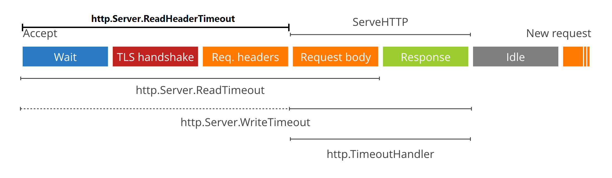

* server_example.go
```go
svr := &http.Server{
	Addr:              "127.0.0.1:8080",
	Handler:           myHandler,
	ReadTimeout:       50 * time.Millisecond,
	ReadHeaderTimeout: 20 * time.Millisecond,
	WriteTimeout:      100 * time.Millisecond,
	IdleTimeout:       1000 * time.Millisecond,
	MaxHeaderBytes:  1 << 20,
}
log.Println(svr.ListenAndServer())
```

* server.ListenAndServe
```go
func (srv *Server) ListenAndServe() error {
	// ...
	ln, err := net.Listen("tcp", addr)

	return srv.Serve(tcpKeepAliveListener{ln.(*net.TCPListener)})
}
```

* server.Serve
```go
func (srv *Server) Serve(l net.Listener) error {
	// ...
	for {
		// 循环接收连接    
		rw, e := l.Accept()

		// ...
		c := srv.newConn(rw)
		c.setState(c.rwc, StateNew) // before Serve can return

		// 每个连接新起一个协程处理【是针对tcp连接、不是针对http请求】
		go c.serve(ctx)
	}
}
```

* conn.serve
```go
func (c *conn) serve(ctx context.Context) {
	// ...
	defer func() {
		// ...

		// 关闭当前连接        
		if !c.hijacked() {
			c.close()
			c.setState(c.rwc, StateClosed)
		}
	}()

	// 当前连接循环接收请求    
	for {
		// readRequest 只读取header, 开始时设置ReadHeaderTimeout, 结束时设置ReadTimeout, WriteTimeout
		w, err := c.readRequest(ctx)
		if c.r.remain != c.server.initialReadLimitSize() {
			// If we read any bytes off the wire, we're active.
			c.setState(c.rwc, StateActive)
		}
		// ...

		//  处理业务逻辑, 包括body的读取
		serverHandler{c.server}.ServeHTTP(w, w.req)

   		// 设置连接为空闲状态
		c.setState(c.rwc, StateIdle)

		// 如果指定不使用长连接, 处理完当前请求直接返回
		if !w.conn.server.doKeepAlives() {
			return
		}
		// 设置空闲超时时间
		if d := c.server.idleTimeout(); d != 0 {
			c.rwc.SetReadDeadline(time.Now().Add(d))  // 其实也是通过设置ReadDeadline来控制的
			if _, err := c.bufr.Peek(4); err != nil {
				return
			}
		}
		// 设置读超时时间 , 所以这两个       
		c.rwc.SetReadDeadline(time.Time{})
	}
}
```

* conn.readRequest
```go
// readRequest 只读取header
func (c *conn) readRequest(ctx context.Context) (w *response, err error) {
	// ...
	var (
		wholeReqDeadline time.Time // or zero if none
		hdrDeadline      time.Time // or zero if none
	)

	t0 := time.Now()
	if d := c.server.readHeaderTimeout(); d != 0 {
		hdrDeadline = t0.Add(d)
	}
	if d := c.server.ReadTimeout; d != 0 {
		wholeReqDeadline = t0.Add(d)
	}

	// 设置HeaderReadTimeout
	c.rwc.SetReadDeadline(hdrDeadline)

	// defer设置WriteTimeout
	if d := c.server.WriteTimeout; d != 0 {
		defer func() {
			c.rwc.SetWriteDeadline(time.Now().Add(d))
		}()
	}

	// 读完hader后设置ReadTimeout
	// Adjust the read deadline if necessary.
	if !hdrDeadline.Equal(wholeReqDeadline) {
		c.rwc.SetReadDeadline(wholeReqDeadline)
	}

	// ...
}
```

* 服务端超时控制

