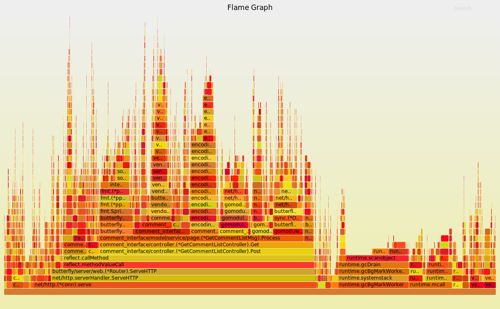

在计算机性能调试领域里, profiling 就是服务的画像, 这里画像就是服务使用 CPU 和内存等的情况. 也就是说服务使用了多少 CPU 资源、都是哪些部分在使用?每个函数使用的比例是多少、有哪些函数在等待 CPU 资源等. 知道了这些, 我们就能对应用进行规划, 也能快速定位性能瓶颈.   

在 go 语言中, 主要关注的服务运行情况主要包括以下几种
* CPU profile  
程序的 CPU 使用情况, 按照一定频率去采集应用程序在 CPU 和寄存器上面的数据  

* Memory Profile(Heap Profile)  
程序的内存使用情况  

* Block Profiling  
goroutines 不在运行状态的情况, 可以用来分析和查找死锁等性能瓶颈   

* Trace Profiling  
报告程序的调用路径  

* Mutex Profiling  
报告程序竞争锁的持有情况   

* ThreadCreate Profiling  
stack traces that led to the creation of new OS threads   

__profiling的收集方式__

* 工具型应用:  
runtime/pprof库, 以收集cpu为例:
```
  import "runtime/pprof"
  
  f, err := os.Create(cpuprofile)
  if err != nil {
     log.Fatal("could not create CPU profile: ", err)
  }
  defer f.Close()
  
  if err := pprof.StartCPUProfile(f); err != nil {
    log.Fatal("could not start CPU profile: ", err)
  }
  defer pprof.StopCPUProfile()      
```

* web服务型应用:  
net/http/pprof库    
```
  import _ "net/http/pprof"
  
  go func() {
    log.Println("begin listening 8020...")
    http.ListenAndServe(":8020", nil)            
  }()
```

* 性能测试:  
go test -bench . -cpuprofile  prof.cpu 生成采样文件   

__go tool pprof__ 
*  pprof <format> [options] [binary] <source>  
 go tool pprof -png http://10.233.x5.153:8098/debug/pprof/profile   
 生成一个指定格式的文件
 
* pprof [options] [binary] <source>  
go tool pprof http://10.233.x5.153:8098/debug/pprof/profile    
get an interactive shell whose commands can be used to generate various views of a profile  
生成一个终端互动界面, 根据命令可以选择查看各种采样信息

* pprof -http [host]:[port] [options] [binary] <source>  
go tool pprof -http :8080  http://10.233.x5.153:8098/debug/pprof/profile     
get an interactive web interface at the specified host:port that can be used to navigate through various views of a profile.     
生成一个互动的web界面, 可以在浏览器查看各种采样信息

* pprof <source>  
根据已经生成的profile文件进行分析    
go tool pprof cpu.profile  

#### 终端样本分析
* go tool pprof http://10.233.x5.153:8098/debug/pprof/profile  


* File 表示采集的程序
* Type 表示采集的类型
* Duration 表示期望采集时间, Total Samples 表示实际采样时间
* Top5 表示显示运行时间最长的前5个函数
* Showing nodes accounting for 16.21s, 25.03% of 64.76s total 采样数据的时间16.21s占采样总时间64.76s的25.03%
* flat 表示对应函数在总采样时间内实际运行的时间, 特指函数本身的运行时间不包括他调用其他函数等待返回的时间   
number of samples in which the function was running (as opposed to waiting for a called function to return)
* flat% 表示函数运行时间占采样总时间的百分比
* sum% 是对flat%的一个累加值
* cum 表示对应函数在总采样时间内实际出现的时间, 包括函数本身的运行时间和他调用其他函数并等待其返回的时间   
the number of samples in which the function appeared (either running or waiting for a called function to return)
* cum% 表示函数出现时间占总采样时间的百分比

#### 可视化样本分析
* 需要安装 graphviz

* 方法一 >本机：  
$ go tool pprof  http://10.233.145.x3:8098/debug/pprof/profile  
$ png >cpu.png

* 方法二 >远程：  
$ wget -O cpu.pprof "http://10.248.x3.173:8090/debug/pprof/profile  
$ go tool pprof -png cpu.pprof  


* 箭头表示调用方向
* 连线上的时间表示调用在采样上出现(appear)的时间
* 方框表示函数实体
* 0.09s(0.14%) of 46.89s(72.41%) 表示当前函数的真实运行时间是0.09s, 占总采样时间的0.14%. 46.89s表示函数出现的时间, 72.41%表示函数出现的时间占总采样时间的百分比

#### 火焰图
* 需要安装 FlameGraph

* 生成方式

  * Capture stacks-捕获堆栈  
  go tool pprof -raw -output=cpu.pprof  http://10.233.x5.153:8089/debug/pprof/profile?seconds=5

  * Fold stacks-折叠堆栈  
  stackcollapse-go.pl   cpu.pprof > cpu.folded

  * flamegraph.pl-生成svg  
  flamegraph.pl  go_cpu.folded > cpu.svg   
  


* 从 go1.11 go tool pprof 集成了火焰图, 所以 uber 的 go-torch 不再需要, 官方库已经被archive

#### 需要安装的软件
* graphviz
Graph Visualization Software 是一个由AT&amp;T实验室启动的开源工具包, 用于绘制DOT语言脚本描述的图形.  Graphviz由 DOT语言的图形描述语言与一组可以生成和/或处理DOT文件的工具组成  
下载：https://graphviz.gitlab.io/\_pages/Download/Download_source.html   

* FlameGraph
将flamegraph.pl移到PATH下, 这个文件主要是将捕获的信息渲染成svg格式用的, 而且支持自定义宽高字体颜色等属性, 这个主要是生成火焰图使用  
下载：https://github.com/brendangregg/FlameGraph

#### 参考文章
https://blog.golang.org/profiling-go-programs
