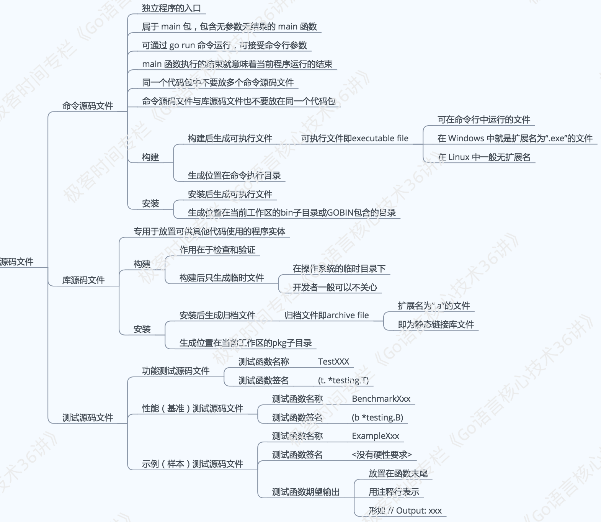

#### 安装过程

* 下载  
wget https://storage.googleapis.com/golang/go1.6.2.linux-amd64.tar.gz  --no-check-certificate   下载的是二进制包，所以不用安装

* 解压  
tar zxvf go1.6.2.linux-amd64.tar.gz

* 配置  
```
export GOROOT=/home/itczl/software/go                 #go的安装目录  
export GOPATH=/home/itczl/projects/golang             #go的工作目录，:~/goproject,这样两个目录都是工作区  
export GOBIN=/home/itczl/projects/golang/bin          #go程序的可执行文件目录，如果不设置，可执行程序在工作目录下的bin目录  
export PATH=$GOROOT/bin:$GOBIN:$PATH                  #添加go命令和我们程序生成的可执行文件到path  
```

* 查看版本  
go version

#### vim配置

* 下载vim-go  
go get  https://github.com/itczl22/vim-go

* 解压  

* 执行如下命令  
cd ~/.vim;  
mkdir compiler ftplugin indent syntax;  
cd /usr/home/zhenliang/projects/software/go/misc/vim-go;  
cp compiler/go.vim ~/.vim/compiler/;  
cp ftplugin/go.vim ~/.vim/ftplugin/;  
cp indent/go.vim ~/.vim/indent/;  
cp syntax/go.vim ~/.vim/syntax/;  
cp -r ftdetect/ ~/.vim/  

#### 工作区目录结构

* src  
存放源码文件 以代码包为组织形式  

* pkg  
存放归档文件 .a为结尾， 所有归档文件都会被存放到该目录下的平台相关目录中，同样以代码包为组织形式  
平台相关目录是指：$GOOS_$GOARCH，如：linux_amd64。 这是两个隐藏的环境变量，GOOS是操作系统，GOARCH指计算机架构  

* bin  
用于存放当前工作区中的Go程序的可执行文件， 当环境变量GOBIN已有效设置时，该目录会变的无意义; 当GOPATH的值中包含多个工作区的路径时，必须设置GOBIN，否则无法成功安装Go程序的可执行文件  

#### 源码文件的分类和含义  
* 命令源码文件  
go语言程序， 声明自己属于main代码包、包含无参数声明和结果声明的main函数  

* 库源码文件  
go语言程序， 不具备命令源码文件的那两个特征的源码文件即不是main包也没有main函数  

* 测试源码文件  
辅助源码文件， 不具备命令源码文件的那两个特征的源码文件。名称以_test.go为后缀,其中至少有一个函数的名称以Test或Benchmark为前缀。并且，该函数接受一个类型为 \*testing.T或\*testing.B的参数  
```
  func TestFind(t *testing.T){ … }           功能测试函数
  func BenchmarkFind(b *testing.B){ … } 性能测试函数
```

* 图示  


go语言命令  

* go run  
go run src/test/hello.go 直接运行，并不生成./bin/test文件，一般用于测试  

* go build  
用于编译源码文件或代码包，如果不追加任何参数，他会试图把当前目录作为代码包并编译  
编译非命令文件不会产生任何结果文件，只是检查库源码文件的有效性  
编译命令源码文件会在**该命令的执行目录中**生成一个可执行文件(就是被编译的命令源码文件的结果文件)  
go build是以GOPATH为相对路径的，所以在哪个目录下都可以执行的  
执行该命令并以代码包的导入路径为参数时，该代码包及其依赖会被编译，和 -a 参数一样  
如果你的源代码针对不同的操作系统需要不同的处理，那么你可以根据不同的操作系统后缀来命名文件, 例如有一个读取数组的程序，它对于不同的操作系统可能有如下几个源文件：`array_linux.go array_darwin.go array_windows.go array_freebsd.go`, go build的时候会选择性地编译以系统名结尾的文件, 例如Linux系统下面编译只会选择array_linux.go文件，其它系统命名后缀文件全部忽略  

参考：https://github.com/hyper0x/go_command_tutorial/blob/master/0.1.md  

* go install  
用于编译并安装代码包或源码文件, 执行该命令并以代码包的导入路径为参数时，该代码包及其依赖会被安装

* go get  
从远程代码仓库下载并安装代码包  
```
  -d：     只执行下载命令而不安装（比如需要一些特殊安装时可以这样）
  -u：     利用网络来更新本地代码包及其依赖包
  -x：     打印get过程中需要运行的命令，且真正执行他们
  -fix：   下载代码包后先执行修正动作，然后再编译安装
```

* go fmt  
go fmt src/test/hello.go 会利用gofmt格式化hello.go文件    其实是执行了gofmt -l -w命令  
go fmt test 格式化test包的所有文件，the gofmt tool sorts the package names into alphabetical order  
gofmt会自动格式化代码, 默认是输出到stdout不修改源文件，-w参数表示不输出直接格式化源文件

* go doc  
doc cmd/gofmt 查看gofmt的文档
go doc config 显示当前目录下的config包的document
godoc显示包的文档，godoc math显示标准库的math包文档，等价于godoc cmd/math。显示的就是golang.org的内容

* go import  
自动处理包的导入

* go test  
运行测试文件，go test xxx_test.go  

#### 代码包的声明原则  

* 同目录下的源码文件的代码包声明语句要一致。也就是说，它们要同属于一个代码包

* 如果目录中有命令源码文件，那么其他种类的源码文件也应该声明属于main包。这也是我们能够成功构建和运行它们的前提  

* 源码文件声明的包名可以与其所在目录的名称不同，只要这些文件声明的包名一致就可以，最常见的就是main包，他的包名和目录一般都不一致, 在针对代码包进行构建时，**生成的结果文件的主名称与其父目录的名称一致**

* import后面的其实是GOPATH开始的相对目录路径，包括最后一段。但由于一个目录下只能有一个package，所以import一个路径就等于是import了这个路径下的包。即import a/b/c 最后的 c 为目录名，不是 package name c1. 但是调用c里边的方法时用的是包名c1不是目录c.

* 我们在构建或者安装这个代码包的时候，提供给go命令的路径是相对于GOPATH目录的相对路径

* 一个非main包在编译后会生成一个.a文件（在临时目录下生成，除非使用go install安装到 $GOROOT 或 $GOPATH下，否则你看不到 .a），用于后续可执行程序链接使用

* 在 Go 1.5 及后续版本中，我们可以通过创建internal代码包让一些程序实体仅仅能被当前模块中的其他代码引用。这被称为 Go 程序实体的第三种访问权限：模块级私有。 具体规则是，internal代码包中声明的公开程序实体仅能被该代码包的直接父包及其子包中的代码引用。当然，引用前需要先导入这个internal包。对于其他代码包，导入该internal包都是非法的，无法通过编译

#### 代码包的导入  

* 代码包导入语句中使用的包名称应该与其导入路径一致，例如: flag fmt strings import("flag" "fmt" "strings")  

* 代码包导入方法  
```
  正常导入：     import "strings";       strings.HasPrefix("abc", "a")            用包名称引用
  带别名的导入： import str  "strings";  str.HasPrefix("abc","a")                用别名引用
  本地化的导入： import .  "strings";    HasPrefix("abc","a")                    直接调用
  仅仅初始化：   import _  "strings";    仅执行代码包中的初始化函数init()    不可调用   
```

#### vendor  

* 依赖vendor的查找顺序  
  1. 当前包下的vendor目录
  2. 依次向上级目录查找，直到找到src下的vendor目录
  3. 在GOPATH下面查找依赖包
  4. 在GOROOT目录下查找


* 在一个应用中，（包含main的package），建议只有一个vendor目录在代码库一级目录  
也就是说拥有了vendor后，你的project依赖的第三方包统统放在vendor/下, 使得你的project无论被下载到那里都可以无需依赖目标环境而编译通过
你在源码中不用理会vendor这个路径的存在，该怎么import包就怎么import，不要出现import "d/vendor/p"的情况。vendor是由go tool隐式处理的作为lib的包不携带vendor更佳

#### 编码规范  

* 注释必须是完整的一句话，以点号 . 结尾  

* Doc comments  
所有顶级，导出的名称都应具有doc注释，以及重要的非导出类型和函数声明

* Comment sentences  
Comments documenting declarations should be full sentences. Comments should begin with the name of the thing being described and end in a period. Each line is no more than 80 characters

* Package comments  
package comments, like all comments to be presented by godoc but must appear adjacent to the package clause, with no blank line and only presented in one go file

* Package name  
packages are given lower case, single-word names; there should be no need for underscores or mixedCaps

* Declaring empty slice  
prefer  `var t []string   to   t := []string{}`. The former avoids allocating memory if the slice is never appended to

* Don\`t panic  
Don't use panic for normal error handling. Use error and multiple return values.

* Error string  
Error strings should not be capitalized (unless beginning with proper nouns or acronyms) or end with punctuation, since they are usually printed following other context.  `fmt.Errorf("something bad") not fmt.Errorf("Something bad")`

* Handle errors  
Do not discard errors using _ variables. If a function returns an error, check it to make sure the function succeeded

* Imports  
Imports are organized in groups, with blank lines between them. The standard library packages are in the first group

* Indent Error Flow  
Try to keep the normal code path at a minimal indentation, and indent the error handling, dealing with it first.

* Initialism  
URL or url  not Url, appID not appId, ServerHTTP not ServerHttp

* Mixed  Caps  
constant like MixedCaps(exported) or mixedCaps(unexported)

* Receiver name  
often a one or two letter abbreviation of its type suffices (such as "c" or "cl" for "Client").  Don't use generic names such as "me", "this" or "self". If you call the receiver "c" in one method, don't call it "cl" in another. 

* Receiver type  
  * value  
A value receiver can reduce the amount of garbage that can be generated.   
Receiver is a map, func or chan.  
Receiver is a slice and the method doesn't reslice or reallocate the slice.  
如果需要改变她的cap就用pointer(s \*[]int)传递，比如你要在另一个函数里边不断append, slice本身是引用传递，即通过被调函数改了调用函数跟着变化，但是reslice会彻底改变他的地址的！！注意区别

  * pointer  
Method needs to mutate the receiver.  
Receiver is a large struct or array.  
Receiver is a struct that contains a sync.Mutex or similar synchronizing field.  
when in doubt, use a pointer receiver.  

* Variable name  
  * Short rather than long
  * Prefer c to lineCount. Prefer i to sliceIndex.
  * Common variables such as loop indices and readers can be a single letter (i, r).
  * More unusual things and global variables need more descriptive names.


* Interface name  
  * 一个函数的接口以er结尾，如：Reader  Writer.  
  * 两个函数的接口数组结合两个函数名，如：ReadWriter.  
  * 3个以上的函数接口名类似于结构体名，如：Car.
