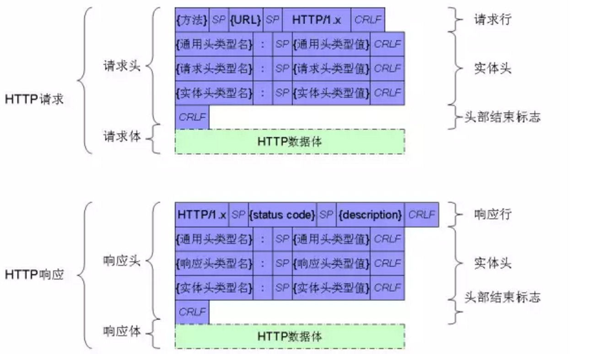
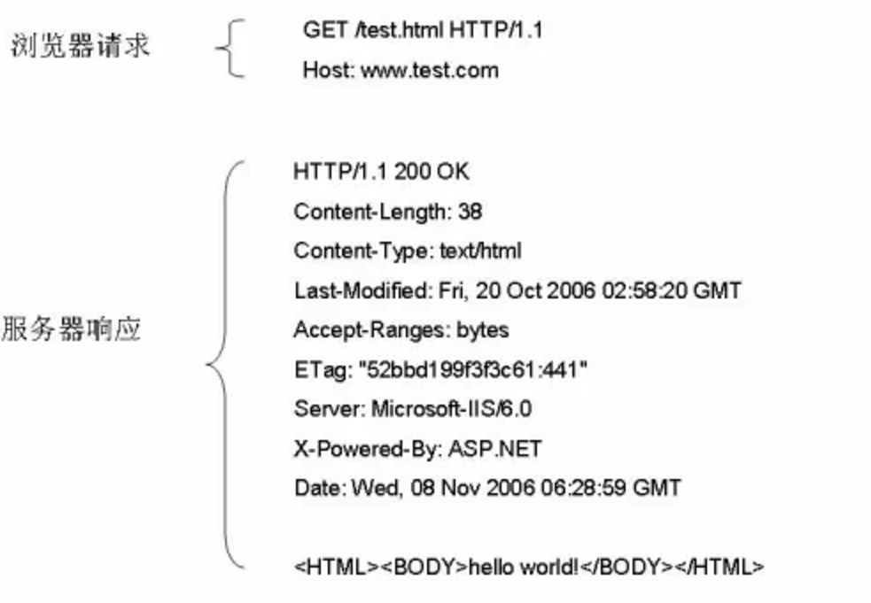
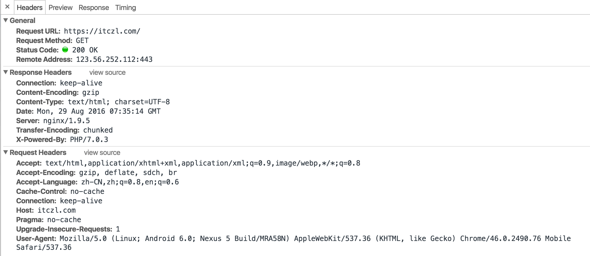

http://www.ruanyifeng.com/blog/2016/08/http.html
# HTTP协议
## 简介
- 超文本传输协议（Hypertext Transfer Protocol, 简称HTTP）是应用层协议, 自 1990 年起, HTTP 就已经被应用于 WWW 全球信息服务系统
- HTTP 是一种请求/响应式的协议. 一个客户机与服务器建立连接后, 发送一个请求给服务器, 服务器接到请求后, 给予相应的响应信息
- HTTP 的第一版本 HTTP/0.9是一种简单的用于网络间原始数据传输的协议
- HTTP/1.0由 RFC 1945 定义 , 在原 HTTP/0.9 的基础上, 有了进一步的改进, 允许消息以类 MIME 信息格式存在, 包括请求/响应范式中的已传输数据和修饰符等方面的信息, HTTP1.0采用的是短连接
- HTTP/1.1(RFC2616) 的要求更加严格以确保服务的可靠性, 增强了在HTTP/1.0 没有充分考虑到分层代理服务器、高速缓冲存储器、持久连接需求或虚拟主机等方面的效能, HTTP1.1支持长连接
- 安全增强版的 HTTP （即HTTPS）, 则是HTTP协议与安全套接口层(SSL)的结合, 使HTTP的协议数据在传输过程中更加安全
- HTTP是无状态的, 协议对于事务处理没有记忆能力，服务器不知道客户端是什么状态. 也就是说打开一个服务器上的网页和你之前打开这个服务器上的网页之间没有任何联系, 为了解决这个问题，于是产生了session和cookie

## 协议结构
HTTP协议格式也比较简单, 格式如下

## HTTP协议举例
- 下面是一个HTTP请求及响应的例子

- 下面是浏览器中显示的格式  

## 请求头格式
- 请求行
    - 请求方法  请求资源  协议版本 CRLF
    - 示例: Get /test.php HTTP/1.1
- 通用头(general-header)
    - Connection: 客户端是否希望与服务端之间保持长连接, 如"Connection: close","Connection: keep-alive"
    - Date: 时间, 只有当请求方法为POST或PUT方法时客户端才可能会有些字段
    - Cache-Control: 客户端希望服务端如何缓存自己的请求数据, 如"Cache-Control: no-cache","Cache-Control: max-age=0"
- 请求头(request-header)
    - Host: 客户请求的主机域名或主机IP, 格式:"Host: 域名或IP[:端口号]", 如:"Host: https://itczl.com", 请求行中若有HTTP/1.1则必须有该请求头
    - User-Agent: 表明用户所使用的浏览器标识, 主要用于统计的目的
    - Referer: 指明该请求是从哪个关联连接而来, 简单的防钓鱼
    - Accept: 表明客户同端可接受的请求回应的媒体类型范围列表. 星号'*'用于按范围将类型分组, 用'*/*'指示可接受全部类型,用'type/*'指示可接受type类型的所有子类型, 如"Accept: text/html, image/gif, image/jpeg, */*"
    - Accept-Charset: 客户端所能识别的字符集编码格式, 格式:"Accept-Charset: 字符集1[:权重], 字符集2[:权重]", 如:"Accept-Charset: iso-8859-5, unicode-1-1;q=0.8" 
    - Accept-Language: 客户端所能识别的语言, 格式:"Accept-Language: 语言1[:权重], 语言2[:权重]", 如:"Accept-Language: zh-CN, en;q=0.7" 
    - Accept-Encoding: 客户端所能识别的编码压缩格式, 如:"Accept-Encoding: gzip, deflate" 
    - Pragma: 包含了客户端一些特殊请求信息, 如"Pragma: no-cache"客户端希望代理或应用服务器不应缓存与该请求相关的结果数据 
    - Cookie: 为扩展字段, 存储于客户端, 向同一域名的服务端发送属于该域的cookie, 如: "Cookie: name=itczl"
- 实体头(entity-header)-(此类头存在时要求有数据体)
    - Content-Encoding: 客户端所能识别的编码压缩格式, 如:"Content-Encoding: gzip, deflate" 
    - Content-Length: 客户端以POST方法上传数据时数据体部分的内容长度, 如:"Content-Length: 24" 
    - Content- Type: 客户端发送的数据体的内容类型, 如:"Content-Type: application/x-www-form-urlencoded"为以普通的POST方法发送的数据;"Content-Type: multipart/form-data; boundary=—————————5169208281820", 则表明数据体由多部分组成, 分隔符为"—————————–5169208281820" 

## 响应头格式
- 响应行
    - 协议版本  状态码  描述信息 CRLF
    - 示例: HTTP/1.1  200  OK
- 通用头(general header)
    - Connection: 服务端是否希望与客户端之间保持长连接, 如"Connection: close","Connection: keep-alive"
    - Date: 响应时间, 只有当请求方法为POST或PUT方法时客户端才可能会有些字段 
    - Pragma: 包含了服务端一些特殊响应信息, 如"Pragma: no-cache"服务端希望代理或客户端不应缓存结果数据
    - Cache- Control: 服务端要求中间代理及客户端如何缓存自己响应的数据, 如"Cache-Control: no-cache" 不希望被缓存, "Cache-Control: public" 可以被缓存 
    - Transfer-Encoding: 服务端向客户端传输数据所采用的传输模式(仅在HTTP1.1中出现), 如:"Transfer-Encoding: chunked", 注: 该字段的优先级要高于"Content-Length"　字段的优先级
- 响应头(response header)
    - Server: 服务端返回的用于标识自己的一些信息, 如:" Server: Nginx/1.9.5"
    - X-Power-By: 表示服务器用什么技术开发的, 如:"X-Power-By: PHP/7.0.3"
    - Accept-Ranges: 表明服务端接收的数据单位, 如:"Accept-Ranges: bytes"
    - Location: 服务端向客户端返回此信息以使客户端进行重定向, 如:"Location: https://itczl.com"
- 实体头(entity header)-(此类头存在时要求有数据体)
    - Content-Encoding: 服务端所响应数据的编码格式, 如:"Content-Encoding: gzip"
    - Content-Length: 服务端所返回数据的数据体部分的内容长度, 如:" Content-Length: 24"
    - Content-Type: 服务端所返回的数据体的内容类型, 如:"Content-Type: text/html; charset=utf-8"  
    - Set-Cookie: 服务端返回给客户端的cookie数据, 如: "Set-Cookie:name=itczl; expires=Wed,29-Aug-2016 19:40:33 GMT”

## 服务器返回状态码
- 说明
    - 1xx：表明服务端接收了客户端请求, 客户端继续发送请求
    - 2xx：客户端发送的请求被服务端成功接收并成功进行了处理
    - 3xx：服务端给客户端返回用于重定向的信息
    - 4xx：客户端的请求有非法内容
    - 5xx：服务端未能正常处理客户端的请求而出现意外错误
- 举例
    - "100": 服务端希望客户端继续
    - "200": 服务端成功接收并处理了客户端的请求
    - "301": 客户端所请求的URL已经移走, 需要客户端重定向到其它的URL, Moved Permanently 永久转移
    - "302": Found 暂时转移
    - "304": 客户端所请求的URL未发生变化, 表示客户端本地有缓存直接用就行了
    - "400": 客户端请求错误
    - "401": Unauthorized 未认证
    - "403": 客户端请求被服务端所禁止
    - "404": 客户端所请求的URL在服务端不存在
    - "408": Request Time-out 请求超时
    - "413": Request Entity Too Large 请求实体太大, 比如上传的头像过大可能返回这个错
    - "500": 服务端在处理客户端请求时出现异常, 这个问题一般是服务器的程序出现问题
    - "501": 服务端未实现客户端请求的方法或内容
    - "502": 此为中间代理返回给客户端的出错信息, 表明服务端返回给代理时出错, 比如你的shadowsock配置出错时访问网页就汇报502
    - "503": 服务端由于负载过高或其它错误而无法正常响应客户端请求, 貌似 Laravel 维护模式就会返回这个状态码
    - "504": 此为中间代理返回给客户端的出错信息, 表明代理连接服务端出现超时

## HTTP请求方法
- 支持的请求方法有: GET、POST、PUT、DELETE、HEAD、CONNECT、OPTIONS、TRACE  
- 最常用的两种方法是GET和POST, 下边简单说明这两种方法的区别
    - 安全性上: get发出请求的数据显示在地址栏, 而post发出的请求数据会放在HTTP协议的请求体里边
    - 从请求长度的大小上: 其实HTTP本身没有做限制而是浏览器对get的请求长度做限制, 不同浏览器限制不同, 一般是2-8K, 而post没有限制
    - get请求可以添加到收藏夹而post不可以, 因为post请求的url不带参数所以无法收藏
