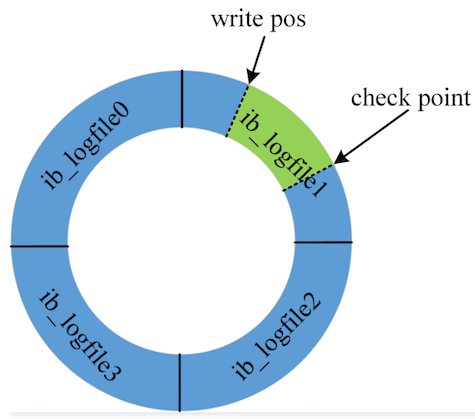
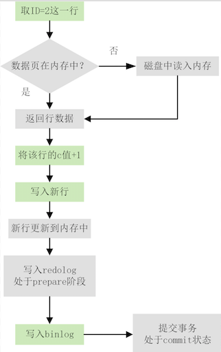

__Mysql 的日志主要分为6种__

* 错误日志(Error Log)
Mysqld 启动、运行、停止所遇到的问题

* 查询日志(General Query Log)
客户端的连接及从客户端接收到的查询记录

* 慢查询日志(Slow Query Log)
执行时间超过 long_query_time 的查询记录

* 二进制日志(Binary Log)
就是常说的binlog，记录所有修改数据的记录，同时也用于主从复制、数据恢复

* 中继日志(Relay Log)
主从复制的时候，从master同步过来的数据更改记录

* 事务日志(Transaction Log)
主要和mysql事务相关的，包括 redo log 和 undo log

其中事务日志的redo log 和 undo log 属于存储引擎层的日志，中继日志是一个中间层，其他的都是server层的日志。本文主要介绍的是写操作相关的日志：binlog、redo log、undo log  

### Redo Log

在 MySQL 中，如果每一次的更新操作都需要实时写入磁盘的话，整个过程 IO 成本、查找成本都很高。为了解决这个问题，MySQL 的设计者就采用了重做日志(redo log) 来提升更新效率。同时通过 rodo log 的两阶段提交来保证数据的一致性，即 crash-safe

__Redo Log 的基本提点__

* 是存储引擎层的日志，也是一种物理日志，记录的是数据页的物理修改，而不是"将某一行或某几行修改成怎样怎样" 的逻辑日志  

* redo log包括两部分：一是内存中的日志缓冲(redo log buffer)，该部分日志是易失性的；二是磁盘上的重做日志文件(redo log file)，该部分日志是持久的

* 它的特性就是 **先写日志，再写磁盘**，即WAL(Write-Ahead Logging)，具体来说，当有一条记录需要更新的时候，InnoDB 引擎就会先把记录写到 redo log里面，并更新内存，这个时候更新就算完成了，api就可以返回了。InnoDB 引擎会在适当的时候，将这个操作记录更新到磁盘里面，而这个更新往往是在系统比较空闲的时候做

__Redo Log的循环写__

* 假设一组有4个文件，循环流程如下图所示  

* write pos是当前记录的位置，一边写一边后移，写到第3号文件末尾后就回到0号文件开头。checkpoint是当前要擦除的位置，也是往后推移并且循环的，擦除记录前要把记录更新到数据文件

* write pos和checkpoint之间的空闲部分可以用来记录新的操作，如果write pos追上checkpoint，表示redo log 写满了，这时候不能再执行新的更新，得停下来先擦掉一些记录，把checkpoint推进一下

__Redo Log 的常用配置__

* innodb_log_files_in_group
指定每个组的文件个数，默认配置为一组 2 个文件，我们业务线上用的是默认配置2

* innodb_log_file_size
每个文件的大小，默认是 48MB, 我们业务线上配的是512M

* innodb_flush_log_at_trx_commit
这个参数是用来控制log buffer(保存redo log 和 undo log)刷新到磁盘的策略。建议设置成 1，这样可以保证 MySQL 异常重启之后数据不丢失

  * innodb_flush_log_at_trx_commit=0，事务发生过程，日志一直积累在log buffer中，在事务提交时不产生 log 的文件写操作，而是MySQL内部每秒操作一次，从log buffer，把数据写入到系统中去。如果数据库发生crash，则丢失1s内的事务修改操作

  * innodb_flush_log_at_trx_commit=1，每次commit都会把log buffer写入到system buffer，并fsync刷新到磁盘文件中

  * innodb_flush_log_at_trx_commit=2，每次事务提交时MySQL只会把日志从log buffer写入到file system buffer，由系统内部来fsync到磁盘文件。如果数据库实例crash，不会丢失log，但是如果服务器crash，由于file system buffer还来不及fsync到磁盘文件，所以会丢失这一部分的数据【我们线上数据库用的是2】

有了redo log，InnoDB就可以保证即使数据库发生异常重启，之前提交的记录都不会丢失，这个能力称为crash-safe。即使服务器宕机了，下次重启的时候只要在redo log里的数据都可以恢复的

### Binary Log

binlog 是Mysql sever层维护的一种二进制日志，与innodb引擎中的redo/undo log是完全不同的日志，其主要是用来记录对mysql的DDL 和 DML 语句。主要用来 进行主从同步 和 通过mysqlbinlog恢复数据

__binlog有三种模式__

可以通过my.cfg配置：binlog_format="STATEMENT"。也可以在启动时根据参数--binlog-format来指定(我们线上业务用的是mixed)

* statement格式，针对的是sql语句，记录的是每次执行的sql语句，--binlog-format=STATEMENT。优点是并非每条更改记录，所以大大减少了binlog日志量，节约磁盘IO，提高性能。缺点是对一些特殊功能的复制效果不是很好，比如：函数、存储过程的复制

* row格式，针对的是每一行数据，记录的是该行记录更新后的值，--binlog-format=ROW。缺点因为每行记录的修改都会记录下来所以会产生大量的日志。优点是每行记录的数据改动都被记录下来，所以不会出现statement格式无法被正确复制的问题

* mixed格式下，MySQL会根据执行的每一条具体的sql语句来区分对待记录的日志形式，也就是在Statement和Row之间选择一种。--binlog-format=MIXED

* 举个例子: `update tab set age=10 where id > 10 and id < 100`, 对于statement格式来说他就记一条sql语句，但是对row格式他需要记录90条记录

__为什么会有binlog和redo log两份日志__

* 因为最开始MySQL里并没有InnoDB引擎 

* MySQL自带的引擎是MyISAM，但是MyISAM没有crash-safe的能力，binlog日志只能用于归档  

* InnoDB是另一个公司以插件形式引入MySQL的，既然只依靠binlog是没有crash-safe能力的，所以InnoDB使用另外一套日志系统——也就是redo log来实现crash-safe能力  

__binlog和redo log的不同点__

* redo log是InnoDB引擎特有的；binlog是MySQL的Server层实现的，所有引擎都可以使用  

* redo log是物理日志，记录的是“在某个数据页上做了什么修改”；binlog是逻辑日志，记录的是这个语句的原始修改逻辑

* redo log是循环写的，空间固定会用完；binlog是可以追加写入的。“追加写”是指binlog文件写到一定大小后会切换到下一个，并不会覆盖以前的日志  

### 一致性保证

为了确保主服务器和从服务器之间的数据一致性，MySQL必须确保binlog和redo log的一致性。两阶段提交-2PC(two-phase commit)正好可以保证两份日志的一致性。

两阶段提交主要是为了保证故障恢复时binlog和redolog的一致性，即crash-safe：

* 所有已提交事务的数据仍然存在

* 所有未提交的事务的数据将自动回滚

MySQL内部两阶段提交需要打开innodb_support_xa = true，默认情况下处于打开状态。如果关闭该事务，则会导致事务数据丢失

__先看下MySQL是如何更新一条数据的`update tb set c = c+1 where id =2;`__

浅绿色框表示是在InnoDB内部执行的，深色框表示是在执行器中执行的

* 执行器先找引擎取ID=2这一行。ID是主键，引擎直接用树搜索找到这一行。如果ID=2这一行所在的数据页本来就在内存中，就直接返回给执行器；否则，需要先从磁盘读入内存，然后再返回给执行器
    
* 执行器拿到引擎给的行数据，把这个值加上1，比如原来是N，现在就是N+1，得到新的一行数据，再调用引擎接口写入这行新数据  

* 引擎将这行新数据更新到内存中，同时将这个更新操作记录到redo log文件里面，此时事务处于prepare状态。然后告知执行器执行完成了，随时可以提交事务  

* 执行器生成这个操作的binlog，并把binlog写入磁盘  

* 执行器调用引擎的提交事务接口把事务从prepare改成提交（commit）状态，更新完成  

>记录binlog是在InnoDB引擎prepare(即Redo Log写入磁盘)之后

我们把上边这个流程切分为3段：1-prepare阶段、2-写binlog、3-commit/rollback

__先写 redo log 后写 binlog__
        
* 假设在 redo log 写完，binlog 还没有写完的时候，MySQL 进程异常重启。由于我们前面说过的，redo log 写完之后，系统即使崩溃，仍然能够把数据恢复回来，所以恢复后这一行 c 的值是 1。crash-safe 时redo log 会重写binlog的
        
* 但是由于 binlog 没写完就 crash 了，这时候 binlog 里面就没有记录这个语句。因此，之后备份日志的时候，存起来的 binlog 里面就没有这条语句。crash-safe 时 binlog不会回写redolog

* 如果需要用这个 binlog 来恢复临时库的话，由于这个语句的 binlog 丢失，这个临时库就会少了这一次更新，恢复出来的这一行 c 的值就是 0，与原库的值不同  
        
__先写 binlog 后写 redo log__

* 如果在 binlog 写完之后 crash，由于 redo log 还没写，崩溃恢复以后这个事务无效，所以这一行 c 的值是 0
        
* 但是 binlog 里面已经记录了“把 c 从 0 改成 1”这个日志。所以，在之后用 binlog 来恢复的时候就多了一个事务出来，恢复出来的这一行 c 的值就是 1，与原库的值不同

由于 redo log 和 binlog 是两个独立的逻辑，无论是先写完 redo log 再写 binlog或者采用反过来的顺序，任何一个出了问题都会导致数据的不一致。但是两阶段提交就可以避免这个不一致性，他可以根据事务的状态和binlog采取提交或者回滚操作

__各阶段奔溃时两阶段提交是如何保证数据一致性的__

* 当在写binlog之前崩溃时重启恢复后发现没有commit，回滚

* 当在写binlog之后崩溃时重启恢复时虽没有commit，但满足redo log和binlog完整，所以重启后会自动commit

__关于双一模式__
双一模式可以保证数据的绝对一致性
* innodb_flush_log_at_trx_commit=1 实时落redo log到磁盘

* sync_binlog=1  实时落binlog到磁盘

### Undo Log

undo log 主要用于mvcc，在rr和rc隔离级别下通过回滚行记录到某个版本用于保证事务中一致性读的。undo log是逻辑日志，根据每行记录进行记录的。另外undo Log除了实现MVCC外，还用于事务的回滚

回滚日志在不需要的时候才删除。也就是说，当系统里没有比这个回滚日志更早的 read-view 的时候，回滚日志会被删除
