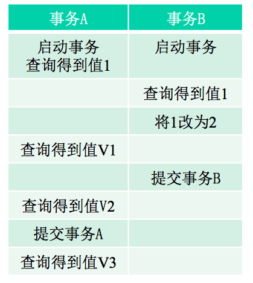
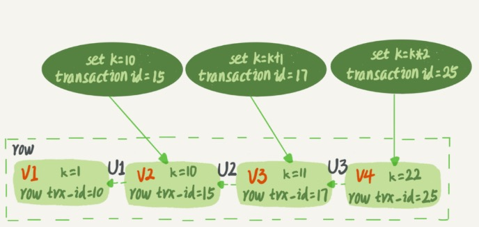
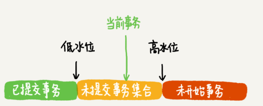
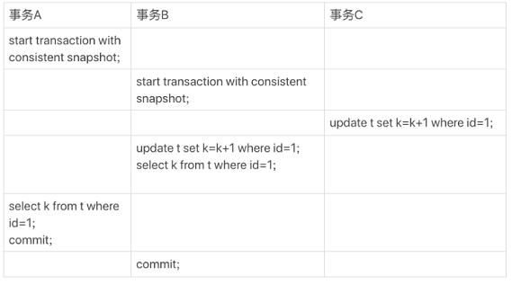
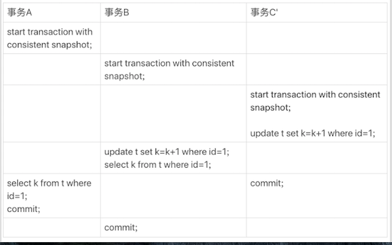

MDL 需要事务来管理，事务有隔离性，MVCC用来实现事务的隔离，undoLog和一致性读视图是来实现MVCC的

### 隔离级别

当数据库上有多个事务同时执行的时候，就可能出现脏读（dirty read）、不可重复读（non-repeatable read）、幻读（phantom read）的问题，为了解决这些问题，就有了“隔离级别”的概念

隔离级别是针对 读的。写的话 都是 当前读，不然的话会出现数据更新错乱，因为写是加了写锁的，是互斥的，如果两个事务同时更新一条记录是必须得一个事务提交了下一个事务才能更新

__SQL 标准的事务隔离级别__

* 读未提交(read uncommitted): 一个事务还没提交时，它做的变更就能被别的事务看到。他采用的是当前读

* 读提交(read committed): 一个事务提交之后，它做的变更才会被其他事务看到，我们线上数据库都是**READ-COMMITTED**

* 可重复读(repeatable read): 一个事务执行过程中看到的数据，总是跟这个事务在启动时看到的数据是一致的，**MySQL默认是REPEATABLE-READ**

* 串行化(serializable): 对于同一行记录，“写”会加“写锁”，“读”会加“读锁”。当出现读写锁冲突的时候，后访问的事务必须等前一个事务执行完成，才能继续执行

__各隔离级别存在的问题__

|           隔离级别         | 脏读(Dirty Read) | 不可重复读(NonRepeatable Read) | 幻读（Phantom Read）|
| :-----------------------  | :-------------  | :--------------------------- | :---------------- |
| 未提交读(Read uncommitted) |      可能        |           可能                |         可能       |
| 已提交读(Read committed)   |     不可能       |           可能                 |         可能       |
| 可重复读(Repeatable read)  |     不可能       |          不可能                |        可能       |
| 可串行化(Serializable )    |     不可能       |          不可能                |        不可能      |

* 脏读
指当一个事务正在访问数据，并且对数据进行了修改，而这种修改还没有提交到数据库中，这时，另外一个事务也访问这个数据，然后使用了这个数据

* 不可重复读
是指在一个事务内，多次读同一数据拿到的结果不保证是一样的。主要是针对update

* 幻读
表示同一事务中使用相同的查询语句第二次查询时，会莫名的多处一些数据，或者莫名的少了一些数据。主要是针对insert和delete

__不同隔离级别下视图的创建__

* 在“读未提交”隔离级别下直接返回记录上的最新值，没有视图概念

* 在“读提交”隔离级别下，这个视图是在 **每个 SQL** 语句 __开始执行__ 的时候创建的，他获取的是当前最新的已提交版本的数据

* 在“可重复读”隔离级别下，这个视图是在 __事务启动__ 时创建的，整个事务存在期间都用这个视图

* 而“串行化”隔离级别下直接用加锁的方式来避免并行访问

__视图__

MySQL中的两个视图的概念

* 一个是 view。它是一个用查询语句定义的虚拟表，在调用的时候执行查询语句并生成结果。创建视图的语法是 create view … ，而它的查询方法与表一样  

* 一个是 consistent read view。InnoDB 在实现 MVCC 时用到的一致性读视图，用于支持 RC（Read Committed，读提交）和 RR（Repeatable Read，可重复读）隔离级别的实现。平时说的快照其实就是一致性读视图

__各隔离级别下事务表现示例__

假设数据表 T 中只有一列，其中一行的值为 1，下面是按照时间顺序执行两个事务的行为，在不同的隔离级别下，事务 A 会有哪些不同的返回结果，也就是图里面 V1、V2、V3 的返回值分别是多少

* 若隔离级别是“读未提交”， 则 V1 的值就是 2。这时候事务 B 虽然还没有提交，但是结果已经被 A 看到了。因此，V2、V3 也都是 2

* 若隔离级别是“读提交”，则 V1 是 1。事务 B 的更新在提交后才能被 A 看到。所以， V2的值是2、V3 的值也是 2

* 若隔离级别是“可重复读”，则 V1、V2 是 1，V3 是 2。之所以 V2 还是 1，遵循的就是这个要求：事务在执行期间看到的数据前后必须是一致的

* 若隔离级别是“串行化”，则在事务 B 执行“将 1 改成 2”的时候，会被锁住。直到事务 A 提交后，事务 B 才可以继续执行。所以从 A 的角度看， V1、V2 值是 1，V3 的值是 2  
    

### 事务

事务用来管理DML语句(insert,update,delete) 就是要保证一组数据库操作，要么全部成功，要么全部失败。在 MySQL 中，事务支持是在引擎层实现的。MySQL 是一个支持多引擎的系统，但并不是所有的引擎都支持事务。比如 MySQL 原生的 MyISAM 引擎就不支持事务，这也是 MyISAM 被 InnoDB 取代的重要原因之一

__事务的启动方式__

* 隐式启动事务语句
set autocommit = 1。MySQL默认就是1，在这种情况下每一条语句就是一个事务。当然也可以用 begin 显式启动的事务，如果执行 commit/rollback 则提交/回滚事务

* 显式启动事务语句
begin 或 start transaction。配套的提交语句是 commit，回滚语句是 rollback。begin/start transaction 命令**并不是一个事务的起点，在执行到它们之后的第一个操作 InnoDB 表的语句，事务才真正启动**  
如果你想要马上启动一个事务，可以使用 start transaction with consistent snapshot 这个命令。上边这种启动方式，一致性视图是在第执行第一个快照读语句时创建的； 这种启动方式，一致性视图是在执行 start transaction with consistent snapshot 时创建的。在读提交隔离级别下，这个用法就没意义了，等效于普通的 start transaction

* set autocommit=0，这个命令会将这个线程的自动提交关掉。意味着如果你只执行一个 select 语句，这个事务就启动了，而且并不会自动提交。这个事务持续存在直到你主动执行 commit 或 rollback 语句，或者断开连接

__事务的特性-ACID__

* Atomicity，原子性，一个事务（transaction）中的所有操作，要么全部完成，要么全部不完成，不会结束在中间某个环节

* Consistency，一致性，在事务开始之前和事务结束以后，数据库的完整性没有被破坏，这个一般是通过隔离性来保证的

* Isolation，隔离性，数据库允许多个并发事务同时对其数据进行读写和修改的能力，隔离性可以防止多个事务并发执行时由于交叉执行而导致数据的不一致

* Durability，持久性，事务处理结束后，对数据的修改就是永久的，即便系统故障也不会丢失

__MVCC__

MVCC，Multi-Version Concurrency Control，多版本并发控制。MVCC 是一种并发控制的方法，一般在数据库管理系统中，实现对数据库的并发访问，主要是通过undoLog和一致性读视图来实现

MVCC只是针对RC（Read Committed）和 RR（Repeatable Read）隔离级别的，读未提交和串行化不需要进行多版本并发控制

MVCC的实现

* 在 MySQL 中，每条记录在更新的时候都会同时记录一条回滚操作(undo log)，记录上的最新值通过回滚操作(逻辑回滚)，都可以得到前一个状态的值，这样同一条记录在系统中可以存在多个版本，这样就实现了数据库的多版本并发控制。InnoDB中通过undoLog实现了数据的多版本，而并发控制通过锁来实现(对同一行记录的更新加行锁)。另外undo Log除了实现MVCC外，还用于事务的回滚

* InnoDB 里面每个事务有一个唯一的事务 ID，叫作 transaction id。它是在事务开始的时候向 InnoDB 的事务系统申请的，是按申请顺序严格递增的。 而每行数据也都是有多个版本的。每次事务更新数据的时候，都会生成一个新的数据版本，并且把 transaction id 赋值给这个数据版本的事务 ID，记为 row trx_id。同时，旧的数据版本要保留，并且在新的数据版本中，能够有信息可以直接拿到它。 也就是说，数据表中的一行记录，其实可能有多个版本 (row)，每个版本的数据通过自己的 row trx_id 来查找

* 下图是一个记录被多个事务连续更新后的状态

* 图中虚线框里是同一行数据的 4 个版本，当前最新版本是 V4，k 的值是 22，它是被 transaction id 为 25 的事务更新的，因此它的 row trx_id 也是 25 
 
* 图中的三个虚线箭头，就是 undo log；而 V1、V2、V3 并不是物理上真实存在的，而是每次需要的时候根据当前版本和 undo log 计算出来的。比如，需要 V2 的时候，就是通过 V4 依次执行 U3、U2 算出来

__事务隔离的实现__

* 首先在事务启动时，InnoDB 为每个事务构造了一个事务数组，用来保存这个事务启动瞬间，当前已经启动了但还没提交的所有事务 ID

* 数组里面事务 ID 的最小值记为低水位 low-water-mark，当前系统里面已经创建过的事务 ID 的最大值加 1 记为高水位 high-water-mark 

* 这个事务数组和高水位，就组成了当前事务的**一致性视图（consistent read-view），

* RR和RC隔离级别下，数据版本的可见性规则，就是基于数据的 row trx_id 和这个一致性视图的对比结果得到的  

这个数组把所有的 row trx_id 分成了几种不同的情况

对于当前事务的启动瞬间来说，一个数据版本的 row trx_id，有以下几种可能： 

* 如果落在绿色部分，表示这个版本是已提交的事务(即事务启动之前已提交的)或者是当前事务自己生成的，这个数据是可见的

* 如果落在红色部分，表示这个版本是由将来启动的事务生成的(事务启动时还没有生成这些事务，在事务执行的过程中新启动的事务)，是肯定不可见的

* 如果落在黄色部分(事务启动时未提交的事务)，那就包括两种情况

    * 若 row trx_id 在数组中，表示这个版本是由还没提交的事务生成的，不可见

    * 若 row trx_id 不在数组中，表示这个版本是已经提交了的事务生成的，可见

因此，一个数据版本对于一个事务视图来说，除了自己的更新总是可见以外，有三种情况：

* 版本已提交，而且是在视图创建前提交的，可见

* 版本未提交，不可见  

* 版本已提交，但是是在视图创建后提交的，不可见  

因为对于RC和RR隔离级别，一致性视图创建的时机是不同的，所以这个规则是都适用的

__可重复读和读提交下事务的查询和更新举例__

insert into t(id, k) values(1,1),(2,2);

查询

* 对于图1，RR下，事务A查到的是1。因为A拿到最新值是(1,3)，(1,3)是B事务修改的不在当前一致性视图内，所以回滚上一个版本到了(1,2)；(1,2)是C事务修改的也不在A的一致性读视图内，因此继续回滚上一个版本到(1,1）；(1,1)是在A启动之前提交的，可见。因为在RR隔离级别下，B和C都是在A启动之后创建的，此时B和C都落在红色区域了。这样执行下来，虽然期间这一行数据被修改过，但是事务 A 不论在什么时候查询，看到这行数据的结果都是一致的，所以我们称之为一致性读

* 对于图1，RC下，事务A查到的是2。因为在RC下视图是在执行每条语句时创建的，A拿到最新值(1,3)是B事务更新的，B没有提交不可以，回滚到上一个版本(1,2)；(1,2)是事务C修改的，且事务C在A的视图创建之前创建的，并且已经提交，所以是可见的

* 对于图2，RR下，事务A查到的是1。B和C都是在A视图创建之后启动的

* 对于图2，RC下，事务A查到的2。事务C已经提交了(C的commit下移一下)

更新

* 对于图1，B查到的是3。因为无论什么隔离级别，更新都是当前读。如果在B更新之前查一下得到的就是1

* 对于图2，B查到的也是3。但是B的更新会被C阻塞，因为C的行锁还没有释放，C提交之后B才可以更新。对于自己的更新自己是认可的，所以B查到的是3

* 更新数据都是先读后写的，而这个读，只能读当前的值，称为“当前读”（current read）。读未提交用的就是当前读

除了update是当前读外，对于select也可以使用当前读

* select k from t where id=1 lock in share mode; 读锁（S 锁，共享锁）

* select k from t where id=1 for update; 写锁（X 锁，排他锁）

### 备注

>尽量不要使用长事务
>>长事务意味着系统里面会存在很老的事务视图。由于这些事务随时可能访问数据库里面的任何数据，所以这个事务提交之前，数据库里面它可能用到的回滚记录都必须保留，这就会导致大量占用存储空间
>>除了对回滚段的影响，长事务还占用锁资源，也可能拖垮整个库

>如果是当前读的话，使用间隙锁也可以解决“幻读”的问题，在可重复读这个隔离级别下，解决了“幻读”的问题后，它与最高的隔离级别“串行化”最重要的区别点是在什么地方？
>>Repeatable Read (RR)
针对当前读，RR隔离级别保证对读取到的记录加锁 (记录锁)，同时保证对读取的范围加锁(间隙锁)，新的满足查询条件的记录不能够插入，不存在幻读现象。
Serializable
从MVCC并发控制退化为基于锁的并发控制。不区别快照读与当前读，所有的读操作均为当前读，读加读锁 (S锁)，写加写锁 (X锁)。
Serializable隔离级别下，读写冲突，因此并发度急剧下降，在MySQL/InnoDB下不建议使用。

