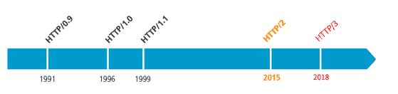
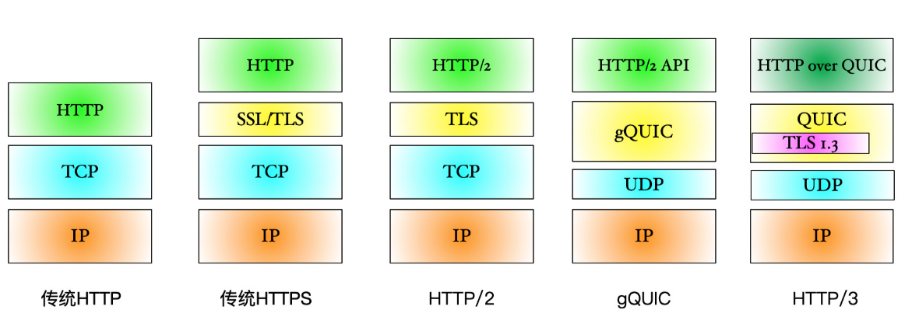
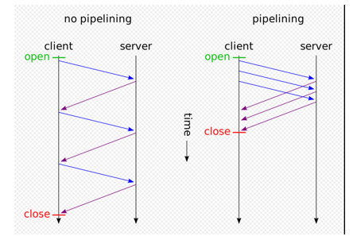
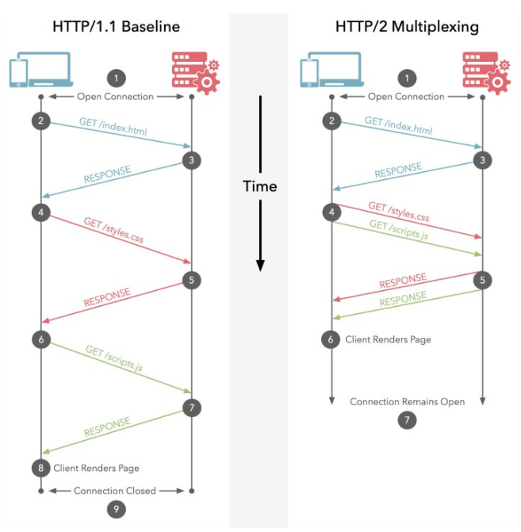

__HTTP的发展历程__

__HTTP1.0 和 HTTP1.1 的区别__

HTTP1.0最早在网页中使用是在1996年，那个时候只是使用一些较为简单的网页上和网络请求上，而HTTP1.1则在1999年才开始广泛应用于现在的各大浏览器网络请求中，同时HTTP1.1也是当前使用最为广泛的HTTP协议

* 缓存处理
在HTTP1.0中主要使用header里的 If-Modified-Since、Expires 来做为缓存判断的标准，HTTP1.1则引入了更多的缓存控制策略例如 Entity tag，If-Unmodified-Since、If-Match、If-None-Match等更多可供选择的缓存头来控制缓存策略

* 带宽优化及网络连接的使用
HTTP1.0中存在一些浪费带宽的现象，如客户端只是需要某个对象的一部分，而服务器却将整个对象送过来了，并且不支持断点续传功能，HTTP1.1则在请求头引入了range头域，它允许只请求资源的某个部分，即返回码是206（Partial Content），这样就方便了开发者自由的选择以便于充分利用带宽和连接

* 错误通知的管理
在HTTP1.1中新增了24个错误状态响应码，如409（Conflict）表示请求的资源与资源的当前状态发生冲突；410（Gone）表示服务器上的某个资源被永久性的删除

* Host头处理
在HTTP1.0中认为每台服务器都绑定一个唯一的IP地址，因此请求消息中的URL并没有传递主机名（hostname）。但随着虚拟主机技术的发展，在一台物理服务器上可以存在多个虚拟主机（Multi-homed Web Servers），并且它们共享一个IP地址，HTTP1.1的请求消息和响应消息都应支持Host头域，且请求消息中如果没有Host头域会报告一个错误（400 Bad Request）

* 长连接的支持
HTTP1.0不支持长连接，每次请求都得创建连接。HTTP 1.1支持长连接（PersistentConnection）和请求的流水线（Pipelining）处理，在一个TCP连接上可以传送多个HTTP请求和响应，减少了建立和关闭连接的消耗和延迟。在HTTP1.1中默认开启长连接 Connection: keep-alive

__HTTP1.x 和 HTTP2.0 的区别__

* 二进制分帧（Binary Frame）
HTTP1.x的解析是基于文本，基于文本协议的格式解析存在天然缺陷，文本的表现形式有多样性，要做到健壮性考虑的场景必然很多，二进制则不同，只认0和1的组合。基于这种考虑HTTP2.0的协议解析决定采用二进制格式，实现方便且健壮
    
* 多路复用（MultiPlexing）
连接共享，一个帧都包含对应的id-stream identifier，这样一个连接上可以同时有多个request，每个连接的request可以随机的混杂在一起，接收方可以根据帧的id将request再归属到各自不同的服务端请求里面。而http1.x 同一个连接只能处理完一个请求再处理下一个请求，没法并行。对于http1.x 的pipeline也只能是同时发动请求，但是响应必须是按顺序一个一个的响应

* header压缩(hpack)
HTTP1.x的header带有大量信息，而且每次都要重复发送，HTTP2.0使用encoder来减少需要传输的header大小，通讯双方各自cache一份header fields表，既避免了重复header的传输，又减小了需要传输的大小。注：这里的压缩不是zip而是减少传输的内容

* 服务端推送（Server Push）
同SPDY一样，HTTP2.0也具有server push功能。他这个push不是我们平时说的主动推送，而是根据当前请求返回后续可能需要的数据。例如用户访问一个html网页，这个html包含了一个style.css和一个style.js，服务端会在发送html的同时将style.css和style.js发给客户端，当客户端再次尝试获取style.css和style.js时就可以直接从客户端缓存中获取到，不用再发请求了

* 优先级控制(Stream Prioritization)
针对高优先级的请求可以调高其weight，使其优先返回。比如浏览器加载首页，首页的html内容应该优先展示，之后才是各种静态资源文件，脚本文件等加载，这样可以保证用户能第一时间看到网页内容

* 加密传输
基于HTTPS的加密协议传输，保留了HTTPS的TLS加密特性，大大提高了传输数据的可靠性(h2c可选)

__HTTP1.1、HTTP1.1 Pipeline、HTTP2.0 Multiplexing 对比__

* HTTP/1.1 without pipelining
Each HTTP request over the TCP connection must be responded to before the next request can be made

* HTTP/1.1 with pipelining
Each HTTP request over the TCP connection may be made immediately without waiting for the previous request's response to return. The responses will come back in the same order(这个浏览器和服务器支持的很少)

* HTTP/2 multiplexing
Each HTTP request over the TCP connection may be made immediately without waiting for the previous response to come back. The responses may come back in any order

* [参考](https://stackoverflow.com/questions/36517829/what-does-multiplexing-mean-in-http-2)

* HTTP1.1 Without Pipelining vs HTTP1.1 Pipelining  

* HTTP1.1 pipelinling vs HTTP2 Multiplexing

__HTTP2.0 和 HTTP3 的区别__

HTTP2.0虽然大大增加了并发性，但还是有问题的。因为HTTP2.0也是基于TCP协议的，TCP协议在处理包时是有严格顺序的，HTTP3放弃了TCP改用UDP  
