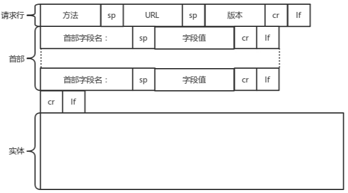
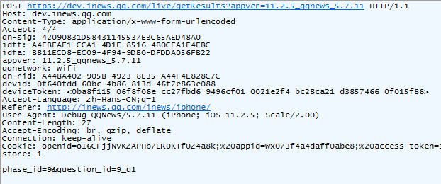
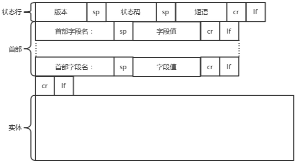
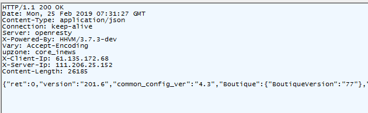
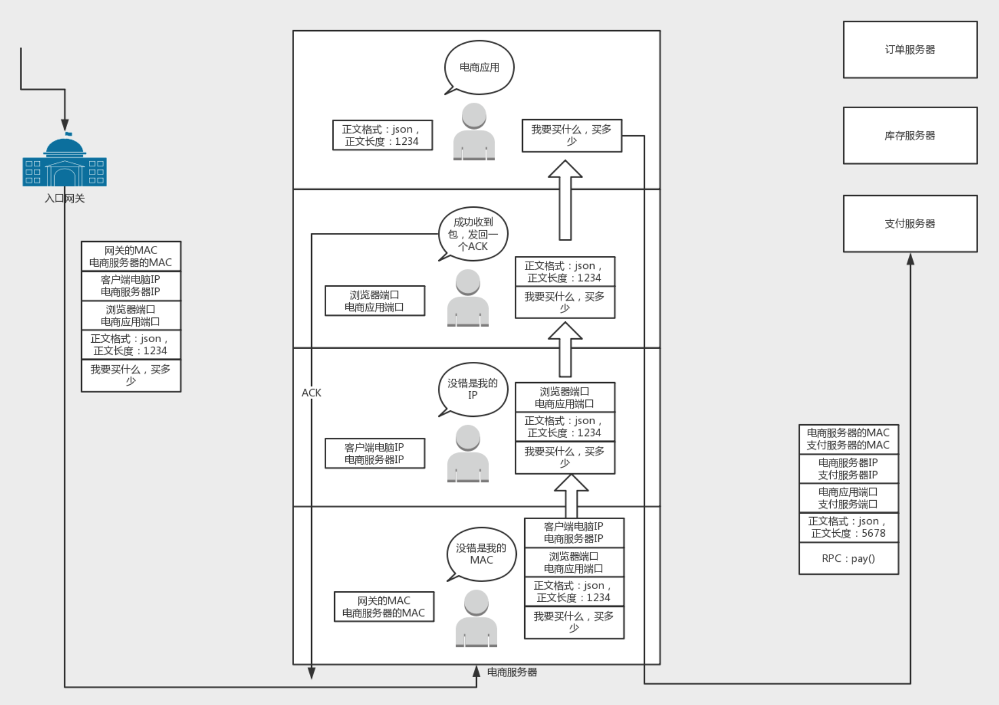

HTTP的全称是：超文本传输协议(HyperText Transfer Protocol)，是一种用于分布式、协作式和超媒体信息系统的应用层协议，建立在TCP协议之上，是万维网的数据通信的基础

__请求格式__

**请求示例**

* 第一部分是请求行，第二部分是请求的首部，第三部分才是请求的正文实体

* get没有实体内容，只有Post实体部分才有内容

__响应格式__

__响应示例__

__http请求的处理过程__

* 客户端会将请求的这个域名发送给DNS服务器, 让它解析为IP地址. 还可以使用另一种更加精准的地址簿查找协议HTTPDNS

* 客户端发起TCP的连接请求，通过三次握手向服务端建立连接

* 客户端将网络请求封装成HTTP报文，发起http请求

* 数据到了TCP层, 它通过TCP分包把二进制流拆分成一个个的TCP数据包发送给服务器，即把一个应用层的完整请求拆分成几部分发送[`对应tcp协议里边的data部分`]。在发送给每个TCP报文段的时候，都需要对方有一个回应ACK，来保证报文可靠地到达了对方，这个回复的包绝非这次下单请求的结果，而仅仅是TCP层的一个说明，即收到之后的回复，当然这个回复，会沿着刚才来的方向走回去。 如果没有回应，那么TCP这一层会进行重新传输，直到可以到达，这个重试绝非你的浏览器重新将下单这个动作重新请求一次，对于浏览器来讲，就发送了一次下单请求，TCP层不断自己闷头重试，除非TCP这一层出了问题，例如连接断了，才轮到浏览器的应用层重新发送下单请求。同一个包有可能被传了好多次，但是HTTP这一层不需要知道这一点，因为是TCP这一层在埋头苦干. (当到了四层tcp层时，查看四层的头看这是一个发起还是一个应答，又或者是一个正常的数据包，然后分别由不同的逻辑进行处理。如果是发起或者应答，接下来可能要发送一个回复包；如果是一个正常的数据包，就需要交给上层了)

* 数据到了IP层，IP层需要查看目标地址和自己是否是在同一个局域网。如果是，就发送ARP协议来请求这个目标地址对应的MAC地址，然后将源MAC和目标MAC放入MAC头，通过网卡发送出去即可。如果目标地址不是本网络内就要去找网关. 而操作系统启动的时候, 就会被DHCP协议配置IP地址(192.168.1.22), 以及默认的网关的IP地址(192.168.1.1). 通过ARP(地址解析协议address resolution protoc)协议后去网关的mac地址，然后将源MAC和网关MAC放入MAC头，通过网卡发送出去。跨网段的通信，一般都是ip包头的目标地址是最终目标地址，但2层包头的mac目标地址总是下一个网关的mac地址

* 网关收到包发现MAC符合，取出目标IP地址，根据路由协议找到下一跳的路由器(路由器是工作在ip层的)，获取下一跳路由器的MAC地址加入到目的MAC头，将包发给下一跳路由器。这样路由器一跳一跳终于到达目标的局域网。网关往往是一个路由器，到某个IP地址应该怎么走，这个叫作路由表(路由器维护)，到哪里应该怎么走，这种沟通的协议称为路由协议，常用的有OSPF和BGP。
  * OSPF(Open Shortest Path First开放式最短路径优先）
  * BGP(Border Gateway Protocol,边界网关协议)

* 这个时候，最后一跳的路由器能够发现，目标地址就在自己的某一个出口的局域网上，于是在这个局域网上发送ARP，获得这个目标主机的MAC地址，将包发出去

* 目标的机器发现MAC地址符合，就将包收起来；发现IP地址符合，根据IP头中协议项，知道自己上一层是TCP协议，于是解析TCP的头，里面有序列号，需要看一看这个序列包是不是我要的，如果是就放入缓存中然后返回一个ACK，如果不是就丢弃

* TCP头里面还有端口号，HTTP的服务器正在监听这个端口号。于是，目标机器自然知道是HTTP服务器这个进程想要这个包，于是将包发给HTTP服务器

* HTTP服务器的进程看到，原来这个请求是要访问一个网页，于是就把这个网页发给客户端

* 返回的流程和上边的类似

