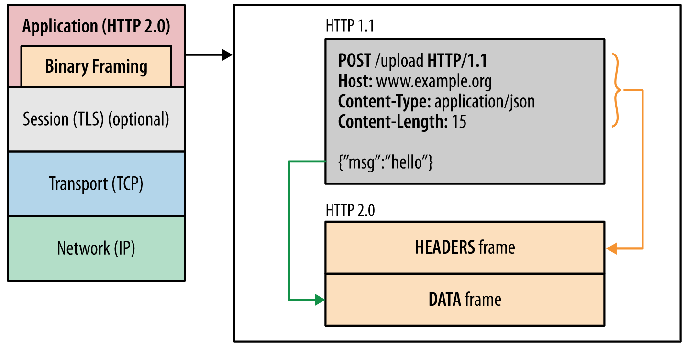
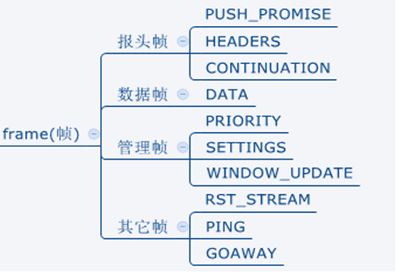
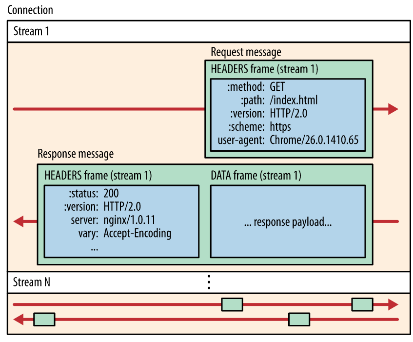
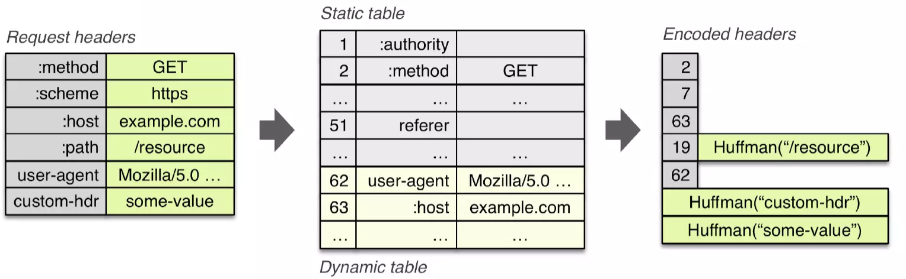
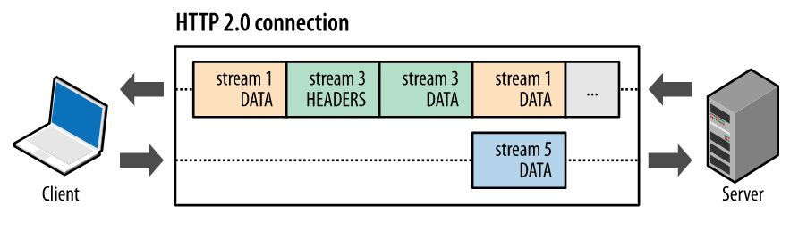
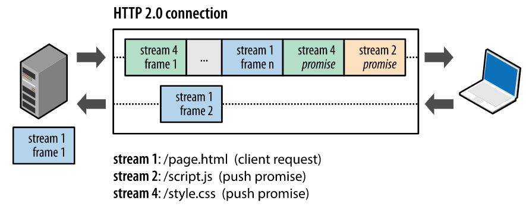

HTTP/2(超文本传输协议第2版，最初命名为HTTP 2.0)，简称为h2(基于TLS/1.2或以上版本的加密连接)或h2c(非加密连接)，是HTTP协议的的第二个主要版本，使用于万维网  

HTTP/2是HTTP协议自1999年HTTP1.1发布后的首个更新，主要基于SPDY协议。主要目标是通过支持完整的请求与响应复用来减少延迟，通过有效压缩 HTTP 标头字段将协议开销降至最低，同时增加对请求优先级和服务器推送的支持  

HTTP/2 仍是对之前 HTTP 标准的扩展，而非替代。 HTTP 的应用语义不变，提供的功能不变，HTTP 方法、状态代码、URI 和标头字段等这些核心概念也不变。


### 为什么使用HTTP2

* HTTP/1.x 有对头阻塞，客户端需要使用多个连接才能实现并发和缩短延迟

* HTTP/1.x 不会压缩请求和响应标头，从而导致不必要的网络流量

* HTTP/1.x 不支持有效的资源优先级，致使底层 TCP 连接的利用率低下

* 多路复用使得连接数量减少对提升 HTTPS 部署的性能来说是一项特别重要的功能：可以减少开销较大的 TLS 连接数、提升会话重用率，以及从整体上减少所需的客户端和服务器资源


## HTTP2的新特性

### 二进制分帧

在 应用层(HTTP/2)和传输层(TCP)之间增加一个二进制分帧层：一个经过优化的新编码机制：HTTP 的语义（包括各种动词、方法、标头）都不受影响，不同的是传输期间对它们的编码方式变了。 HTTP/1.x 协议以换行符作为纯文本的分隔符，而 HTTP/2 将所有传输的信息分割为更小的消息和帧，并采用二进制格式对它们编码

其中 HTTP1.x 的首部信息会被封装到 HEADER frame，而相应的 Request Body 则封装到 DATA frame 里面

这样一来，客户端和服务器为了相互理解，都必须使用新的二进制编码机制，HTTP/1.x 客户端无法理解只支持 HTTP/2 的服务器，反之亦然。 不过现有的应用不必担心这些变化，因为客户端和服务器会替我们完成必要的分帧工作



* 帧的类型

[参考](https://tools.ietf.org/html/rfc7540#section-6)

* 帧的格式
```
 +-----------------------------------------------+
 |                 Length (24)                   |
 +---------------+---------------+---------------+
 |   Type (8)    |   Flags (8)   |
 +-+-------------+---------------+-------------------------------+
 |R|                 Stream Identifier (31)                      |
 +=+=============================================================+
 |                   Frame Payload (0...)                      ...
 +---------------------------------------------------------------+
```

* 数据流、消息和帧
  * 数据流：已建立的连接内的双向字节流，可以承载一条或多条消息

  * 消息：与逻辑请求或响应消息对应的完整的一系列帧

  * 帧：HTTP/2 通信的最小单位，每个帧都包含帧头，至少也会标识出当前帧所属的数据流(stream identifier)

* 数据流、消息和帧 之间的关系

  * 所有通信都在一个 TCP 连接上完成，此连接可以承载任意数量的双向数据流

  * 每个数据流都有一个唯一的标识符和可选的优先级信息，用于承载双向消息

  * 每条消息都是一条逻辑 HTTP 消息（例如请求或响应），包含一个或多个帧

  * 帧是最小的通信单位，承载着特定类型的数据，例如 header frame、message payload frame等。来自不同数据流的帧可以交错发送，然后再根据每个帧头的数据流标识符重新组装

* 

### 头部压缩

每个 HTTP 传输都承载一组header，这些header说明了传输的资源及其属性。 在 HTTP/1.x 中，header始终以纯文本形式，通常会给每个传输增加 500–800 字节的开销，如果使用 HTTP Cookie，增加的开销有时会达到上千字节。为了减少此开销和提升性能，HTTP/2 使用 HPACK 压缩格式压缩请求和响应header数据，这种格式采用两种简单但是强大的技术：
* 静态索引表
通过静态 Huffman 编码对传输的header字段进行编码，从而减小了各个传输的大小。静态索引表是 RFC 预先定义好的，只有固定的几十个值。如果kv都一样直接传编号，如果value不一样只需要传编号和value

* 动态索引表
动态表是一个由先进先出的队列维护的有空间限制的表，最初为空，将根据在特定连接内交换的值进行更新，当一个头部没有出现过的时候，会被插入动态表中，下次同名的值就可能会在表中查到到索引并替换掉头部。每个动态表只针对一个tcp连接，每个连接的压缩解压缩的上下文有且仅有一个动态表

客户端和服务端分别缓存一份索引表，如果头部存在于索引表，则用对应的索引值；否则进行霍夫曼编码，并加入索引表；差量更新两个表




### 多路复用

在 HTTP/1.x 中，如果客户端要想发起多个并行请求以提升性能，则必须使用多个 TCP 连接，单个TCP连接只能串行发送，这种模型也会导致队首阻塞

HTTP/2 中新的二进制分帧层突破了这些限制，实现了完整的请求和响应复用：客户端和服务器可以将 HTTP 消息分解为互不依赖的帧，然后交错发送，最后再在另一端把它们重新组装起来



上图同一个连接内并行有3个个数据流，客户端正在向服务器传输一个 DATA 帧（数据流 5），与此同时，服务器正向客户端交错发送数据流 1 和数据流 3 的一系列帧

多路复用带来巨大的性能提升

* 并行交错地发送多个请求，请求之间互不影响

* 并行交错地发送多个响应，响应之间互不干扰

* 使用一个连接并行发送多个请求和响应

* 不必再为绕过 HTTP/1.x 限制而做很多工作（例如级联文件、image sprites 和域名分片）

* 消除不必要的延迟和提高现有网络容量的利用率，从而减少页面加载时间


### 服务端推送

服务器可以对一个客户端请求发送多个响应，除了对最初请求的响应外，服务器还可以向客户端推送额外资源，而无需客户端明确地请求。该功能一般用在浏览器中，纯后台的服务一般用不到。所有服务器推送数据流都由 PUSH_PROMISE 帧发起

一个典型的网络应用包含多种资源，客户端需要检查服务器提供的文档才能逐个找到它们。 那为什么不让服务器提前推送这些资源，从而减少额外的延迟时间呢？ 服务器已经知道客户端下一步要请求什么资源，这时候服务器推送即可派上用场




### 流量控制

流控制是一种阻止发送方向接收方发送大量数据的机制，以免超出后者的需求或处理能力

收到流控肯定会想到 TCP 流控制，不过，由于 HTTP/2 数据流在一个 TCP 连接内复用，TCP 流控制既不够精细，也无法提供应用层面的 API 来调节各个数据流的传输

为了解决这一问题，HTTP/2 提供了一组简单的构建块，这些构建块允许客户端和服务器实现其自己的数据流和连接级流控制，即应用层面的流控制


## HTTP2的其他问题

#### Nginx支持HTTP2

```
    server {
        listen 443 ssl http2 default_server;
        ssl_certificate    server.crt;
        ssl_certificate_key server.key;
        ...
    }
```

* nginx默认是不开启http2的，所以需要重新编译增加参数：--with-http_v2_module

* [参考](https://www.nginx.com/blog/nginx-1-9-5)

#### HTTP/2 不再依赖多个 TCP 连接去并行复用数据流，仅需要每个来源一个连接，那么针对每个来源还有必要使用连接池么

* [参考问题](https://stackoverflow.com/questions/55985658/do-we-still-need-a-connection-pool-for-microservices-talking-http2)

* 首先，复用数量是由 SETTINGS 帧的 SETTINGS_MAX_CONCURRENT_STREAMS 参数控制的，默认是没有限制，但是官方推荐不应该少于100 -[参考](https://tools.ietf.org/html/rfc7540#section-6.5.2)。go1.13里边设置的是250(http2defaultMaxStreams)，官方后续会调到100，换句话说就是并行250。如果客户端希望以更高的负载使用该服务，则需要准备打开多个连接，而且这对于处理负载峰值也很有用【腾讯新闻这边的grpc连接池是10个】

* 其次，HTTP2具有流控制，这可能会严重限制单个连接上的数据吞吐量。如果流量控制窗口很小（HTTP2规范定义的默认值为65535字节），则客户端和服务器将花费大量时间交换WINDOW_UPDATE帧以扩大流量控制窗口，这不利于吞吐量

* 第三，在HTTP2流控制窗口较大的情况下，可能会遇到TCP拥塞，比如上传服务或者下载服务，如果多开几个连接可以缓解这个问题

* 第四，现在服务一般都是多核cpu，单个TCP连接也没法充分发挥多核的优势。而且每个socket都有一个自己的buffer，要是所有的数据，都通过一个socket发送，延迟也会很大。一般这种连接池在server启动的时候直接创建出来。


### 参考

* [google 开发者](https://developers.google.com/web/fundamentals/performance/http2#%E6%A0%87%E5%A4%B4%E5%8E%8B%E7%BC%A9)
