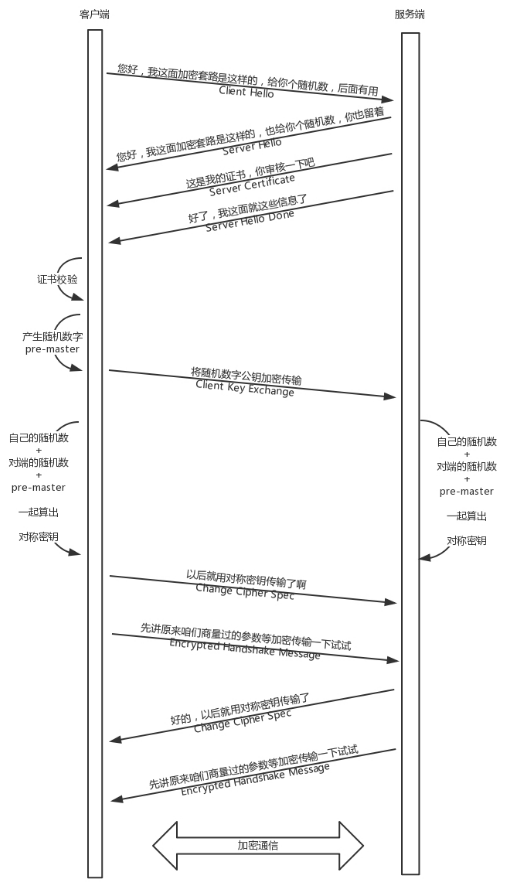
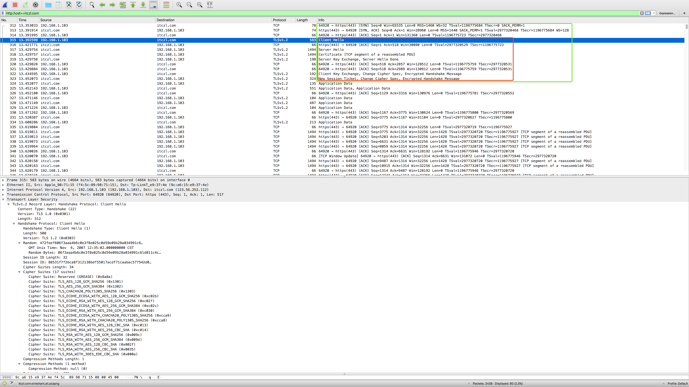

__HTTPS通信三步走__

* 先进行3次握手建立tcp连接

* 然后进行tls握手进行服务器验证和密钥协商

* 最后进行对称加密通信

__TLS握手示意图__

__https抓包示意图__

__主要流程__

* 三次握手建立TCP连接

* Client Hello
客户端会发送Client Hello消息到服务器，以明文传输TLS版本信息、加密套件候选列表、压缩算法候选列表等信息。另外，还会有一个随机数session ticket1，在协商对称密钥的时候使用

* Server Hello
服务端返回 Server Hello 消息, 告诉客户端服务器选择使用的协议版本、加密套件、压缩算法等(从client提供的候选列表选择)，还有一个随机数session ticket2，用于后续的密钥协商

* Certificate
服务端发送服务端证书给客户端

* Server Key Exchange
这一步和具体的加密算法有关
    * 对于RSA算法来说，不需要这一步。certificate message中包含了足够的信息，client key exchange可以使用这些信息加密预主密钥

    * 对于DH这类的算法来说，发送服务器使用的DH参数，certificate message只包含了部分信息，剩余的信息在server key exchange中

* Certificate Request
服务端要求客户端上报客户端自己的证书，这一步是可选的，对于安全性要求高的场景会用到

* Server Hello Done
通知客户端 Server Hello 过程结束

* Certificate Verify
客户端收到服务端传来的证书后，先从 CA 验证该证书的合法性，验证通过后取出证书中的服务端公钥。再生成一个随机数，用服务端公钥非对称加密该随机数生成 PreMaster Key

* Client Key Exchange
客户端发送 Client Key Exchange，将PreMaster Key发给服务器，服务器可以通过私钥解密出来。到目前为止，无论是客户端还是服务器，都有了三个随机数，分别是：自己的、对端的，以及刚生成的Pre-Master，通过这三个随机数，可以在客户端和服务器产生相同的对称密钥

* Change Cipher Spec
客户端通知服务端后面再发送的消息都采用协商的通信密钥和加密算法进行加密通信了，是一条事件消息

* Encrypted Handshake Message
客户端然后发送一个Encrypted Handshake Message，将已经商定好的参数等，采用协商密钥进行加密，发送给服务器用于数据与握手验证。这是客户端发出的第一条加密消息，服务端接收后会用秘钥解密，能解出来说明前面协商出来的秘钥是一致的

* Change Cipher Spec(Server)
这一步是服务端通知客户端后面再发送的消息都会使用加密，也是一条事件消息

* Encrypted Handshake Message(Server)
服务端也会将握手过程的消息生成摘要再用秘钥加密，这是服务端发出的第一条加密消息。客户端接收后会用秘钥解密，能解出来说明协商的秘钥是一致的

* 对称加密通信

__为什么需要3个随机数__

目的是为了保证密钥的随机性  
pre master的存在在于SSL协议不信任每个主机都能产生完全随机的随机数，如果随机数不随机，那么pre master secret就有可能被猜出来，那么仅适用pre master secret作为密钥就不合适了，因此必须引入新的随机因素，那么客户端和服务器加上pre master secret三个随机数一同生成的密钥就不容易被猜出了。 一个伪随机可能完全不随机，可是是三个伪随机就十分接近随机了，每增加一个自由度，随机性增加的可不是一

### https防重放

重放不需要解密数据，也不需要重走https的流程，是直接将原始的加密数据通过传输层发出去

__MAC值防重放(message authentication code)__

* MAC的生成标准
To allow the receiver to be able to detect replay attacks, the message itself must contain data that assures that **this same message can only be sent once (e.g. time stamp, sequence number or use of a one-time MAC)**. Otherwise an attacker could without even understanding its content – record this message and play it back at a later time, producing the same result as the original sender.[参考](https://en.wikipedia.org/wiki/Message_authentication_code#An_example_of_MAC_use)

* https中MAC的产生方法
 To prevent message replay or modification attacks, the MAC is computed from the MAC secret, **the sequence number**, the message length, the message contents, and two fixed character strings.[参考](https://tools.ietf.org/html/rfc4346#appendix-F.2)

* 因为 sequence number是唯一的，如果重放服务端可以识别到是重放的请求

__nonce+timestap防重放__

* nonce
nonce是一个随机数，可以根据时间戳+ip+mac等生产。单纯的nonce缺点是服务端需要额外保存使用过的随机数，若记录的时间段较长，则保存和查询的开销会很大  

* timestamp
单纯的timestap漏洞也是显而易见的，假设一次正常的请求，从发出到达服务器一般都不会超过x秒，如果在x秒内进行重放攻击，那就没办法保证请求仅一次有效

* nonce+timestamp
nonce的一次性可以解决timestamp参数x秒的问题，timestamp可以解决nonce参数“集合”越来越大的问题

__https有了MAC防重放, 为什么还需要nonce+timestamp__

* 因为目前的后端架构大部分都不是Client -> Backend Server 这种直连方式，而是：Client -> Gateway -> Load Balance -> 。。。 -> Backend Server, 对应的通信方式一般是：Client -> HTTPS -> HTTP 。。。 -> Backend Server

* 一般只有最外层网关层和client是https通信，过了网关之后进入内网全部是http通信，nonce+timestamp是为了防止http通信的过程中重放，他是属于业务层面的一种防重放策略
