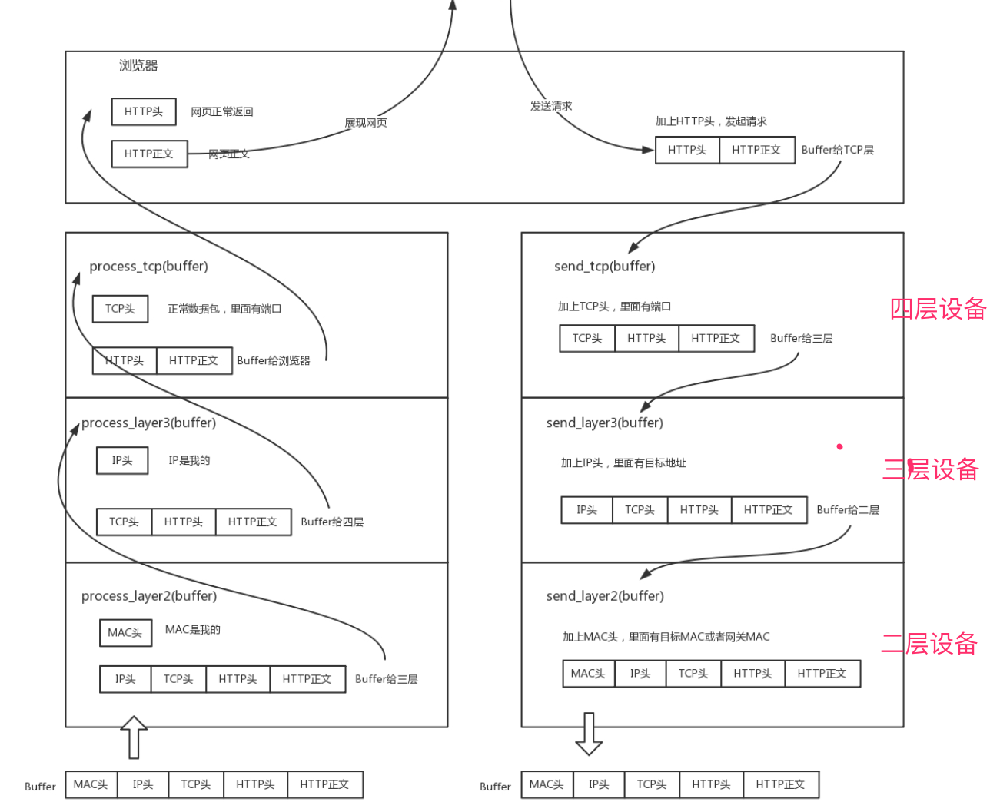
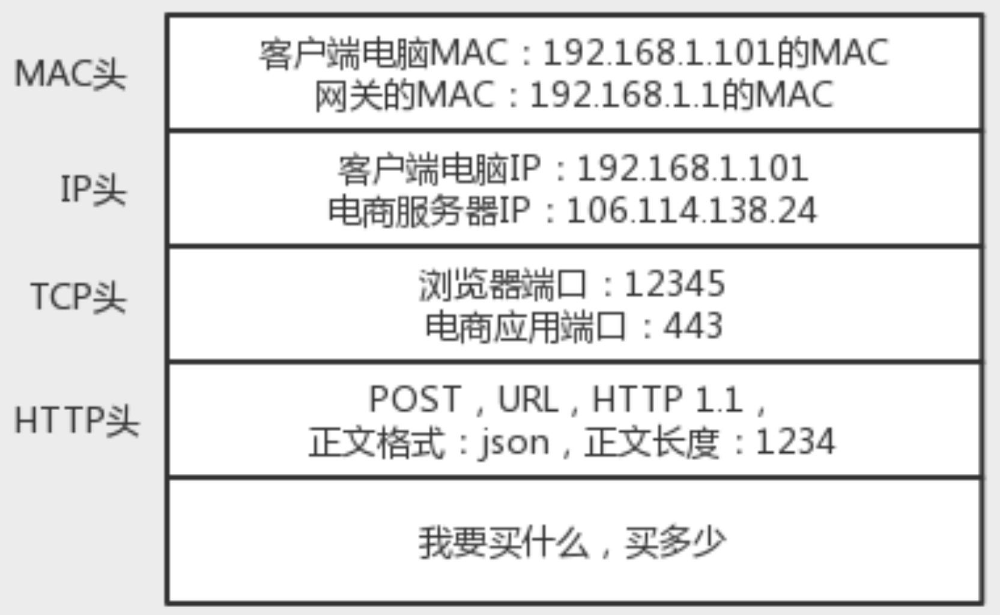
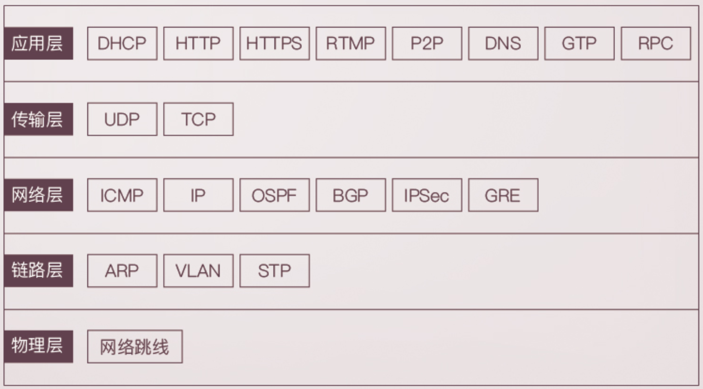
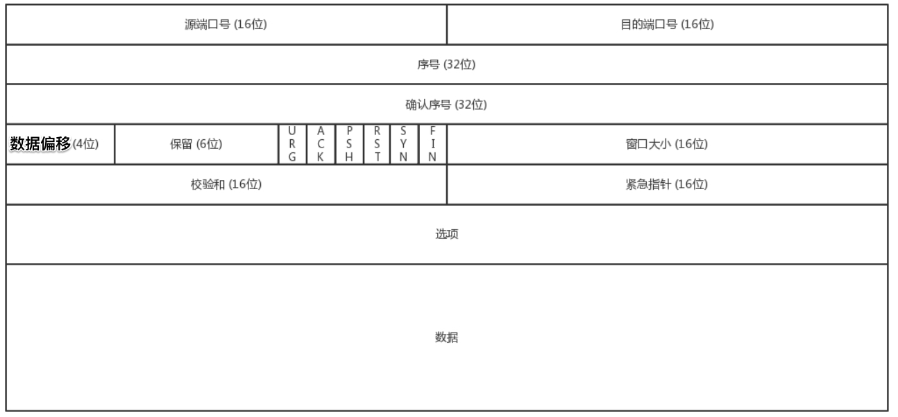
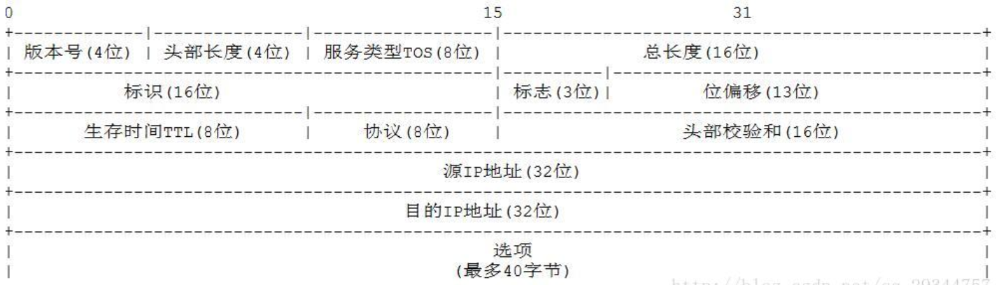
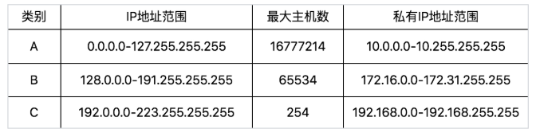

__协议3要素__

* 语法: 是这一段内容要符合一定的规则和格式. 例如: 括号要成对, 结束要是用封号

* 语义: 就是这一段内容要代表某种意义. 例如: 数字减去数字是有意义的, 数字减去文本是没有意义的
  
* 顺序: 就是先干啥, 后干啥. 例如: 可以先加上某个数值, 然后再减去某个数值

__协议分层__

__4层协议头__

__各层主要协议__

__udp包头格式__

__tcp包头格式__

__ip包头格式__

__ip地址分类__

__无类型域间选路(CIDR)__

* 因为A/B/C分类导致主机数要么太少要么太多，于是产生了折中方案CIDR( Classess Iner-Domain Routing )

* 这种方式打破了原来设计的几类地址的做法，将32位的IP地址一分为二，前面是网络号，后面是主机号。

* 比如 10.100.122.2/24，这种地址表示形式，就是CIDR。后面24的意思是前24位是网络号，后8位是主机号。

* 伴随着CIDR存在的，一个是广播地址，10.100.122.255。如果发送这个地址，所有10.100.122网络里面的机器都可以收到。另一个是子网掩码，255.255.255.0，将子网掩码和ip做与运算得到的就是网络号

* 举例: 16.158.165.91/22
  * 16.158.<101001><01>.91/22

  * 网关地址：16.158.<101001><00>.1    -> 16.158.164.1

  * 子网掩码：255.255.<111111><00>.0   -> 255.255.252.0

  * 广播地址：16.158.<101001><11>.255  -> 16.158.167.255

__MAC地址__

* MAC地址是一个网卡的物理地址，用十六进制，6个byte表示。
    
* MAC地址全局唯一，不会有两个网卡有相同的MAC地址，而且网卡自生产出来，就带着这个地址。

* MAC地址的通信范围比较小，局限在一个子网里面。例如，从192.168.0.2/24访问192.168.0.3/24是可以用MAC地址的。一旦跨子网，即从192.168.0.2/24到192.168.1.2/24，MAC地址就不行了，需要IP地址起作用了
