### 顺序性 和 可靠性 

为了保证顺序性，每一个包都有一个ID，在建立连接的时候，会商定起始的ID是什么，然后按照ID一个个发送；为了保证可靠性，不丢包，对于发送的包都要进行应答，但是这个应答也不是一个一个来的，而是会应答某个之前的ID，表示都收到了，这种模式称为累计确认或者累计应答（cumulative+acknowledgment）。要保证顺序和可靠，TCP需要发送端和接收端分别都有缓存来保存这些记录。

__发送端缓存__

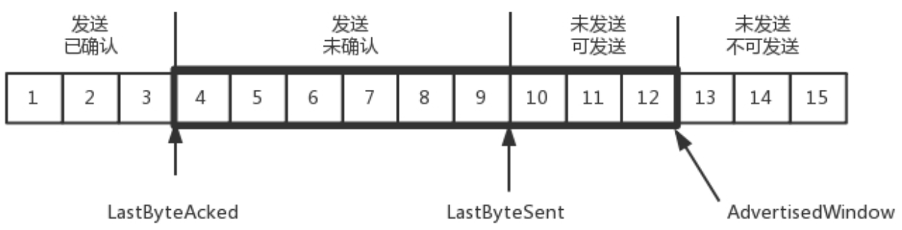

* LastByteAcked：第一部分和第二部分的分界线

* LastByteSent：第二部分和第三部分的分界线

* LastByteAcked + AdvertisedWindow：第三部分和第四部分的分界线，因为要进行流量控制，所以第三部分和第四部分得分开

* AdvertisedWindow：窗口大小，这个窗口的大小应该等于上面的第二部分加上第三部分，就是已经发送了的+马上要发送的。超过这个窗口的，接收端做不过来，就不能发送

__接收端缓存__

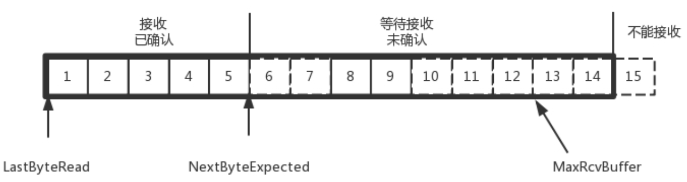

* MaxRcvBuffer：最大缓存的量

* LastByteRead：之后是已经接收了，但是还没被应用层读取的

* NextByteExpected：是第一部分和第二部分的分界线，存放即将到来的数据。其中第二部分里面，由于收到的包可能不是顺序的，会出现空挡，只有和第一部分连续的，可以马上进行回复(就是前边说的累计确认），中间空着的部分需要等待，哪怕后面的已经来了

* AdvertisedWindow = MaxRcvBuffer - ( (NextByteExpected-1) - LastByteRead )

__顺序性和可靠性的保障过程__

* 发送端来看，1、2、3已经发送并确认；4、5、6、7、8、9都是发送了还没确认；10、11、12是还没发出的；13、14、15是接收方没有空间，不准备发的

* 接收端来看，1、2、3、4、5是已经完成ACK，但是没读取的，等待应用层读取；6、7是等待接收的；8、9是已经接收，但是没有ACK的

* 发送端和接收端当前的状态如下
  * 1、2、3没有问题，双方达成了一致

  * 4、5接收方说ACK了，但是发送方还没收到，有可能丢了，有可能在路上

  * 6、7、8、9肯定都发了，但是8、9已经到了，但是6、7没到，出现了乱序，缓存着但是没办法ACK。

* 假设4的确认到了，不幸的是，5的ACK丢了，6、7的数据包丢了，这该怎么办呢？ 重传！主要有一下几种重传策略

* 超时重传
  * 也即对每一个发送了，但是没有ACK的包，都有设一个定时器，超过了一定的时间，就重新尝试。这个时间不宜过短，超时时间必须大于往返时间RTT，否则会引起不必要的重传。也不宜过长，这样超时时间变长，访问就变慢了

  * 超时重传时间RTO(Retransmission TimeOut)，需要TCP通过采样RTT的时间，然后进行加权平均，算出一个值，而且这个值还是要不断变化的，因为网络状况不断的变化。除了采样RTT，还要采样RTT的波动范围，计算出一个估计的超时时间。由于重传时间是不断变化的，我们称为自适应重传算法(Adaptive Retransmission Algorithm)
  * 重传如果一直失败，满一定次数后就会放弃并关闭tcp流。在linux的实现中他不是一个固定的次数，而是根据 tcp_retries1、tcp_retries2、RTT 3个值动态计算出来的

  * 比如过一段时间，5、6、7都超时了，就会重新发送。接收方发现5原来接收过，于是丢弃5；6收到了，发送ACK，要求下一个是7，7不幸又丢了

  * 当7再次超时的时候，又需要重传的时候，TCP的策略是超时间隔加倍。每当遇到一次超时重传的时候，都会将下一次超时时间间隔设为先前值的两倍

  * 超时触发重传存在的问题是，超时周期可能相对较长。由于因为网络毛刺或者随机因素导致的偶尔单个丢包，如果也进行RTO超时重传，会影响网络传输的性能

* 快速重传
  * 当接收方收到一个序号大于下一个所期望的报文段时，就检测到了数据流中的一个间格，于是发送三个相同的冗余的ACK

  * 客户端收到后，就在定时器过期之前，重传丢失的报文段。

  * 例如，接收方发现6、8、9都已经接收了，就是7没来，那肯定是丢了，于是发送三个6的ACK，要求下一个是7。客户端收到3个6的ACK后，就会发现7的确又丢了，不等超时，马上重发

* 选择性重传SACK(Selective+Acknowledgment)
  * 该功能可配置，通过系统参数：net.ipv4.tcp_sack配置；使用sysctl命令修改和查看。
 
  * 这种方式需要在TCP头里加一个SACK的东西(放在选项里边)，可以将缓存的地图发送给发送方。例如可以发送ACK6、SACK8、SACK9，有了地图，发送方一下子就能看出来是7丢了，于是重发7

### 流量控制
1.  在包的确认中，同时会携带一个窗口的大小。我们先假设窗口不变的情况，窗口始终为9。4的确认来的时候，会右移一个，这个时候第13个包也可以发送了
  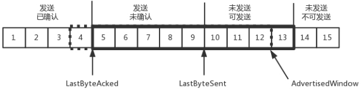

2. 这个时候，假设发送端发送过猛，会将第三部分的10、11、12、13全部发送完毕，之后就停止发送了，未发送可发送部分为0
  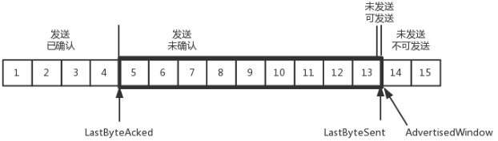

3. 当对于包5的确认到达的时候，在客户端相当于窗口再滑动了一格，这个时候，才可以有更多的包可以发送了，例如第14个包才可以发送
  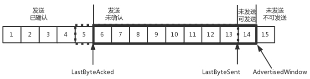

4. 如果接收方实在处理的太慢，导致缓存中没有空间了，可以通过确认信息修改窗口的大小，甚至可以设置为0，则发送方将暂时停止发送  
  我们假设一个极端情况，接收端的应用一直不读取缓存中的数据，当数据包6确认后，窗口大小就不能再是9了，就要缩小一个变为8
  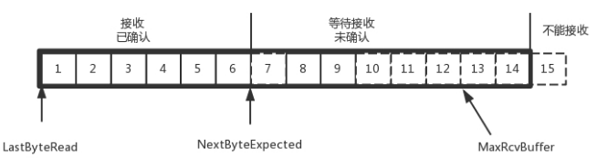

5. 这个新的窗口8通过6的确认消息到达发送端的时候，窗口没有平行右移，而是仅仅左面的边右移了，窗口的大小从9改成了8
  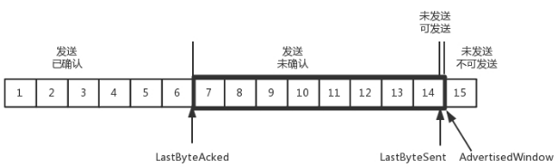

6. 如果接收端还是一直不处理数据，则随着确认的包越来越多，窗口越来越小，直到为0
  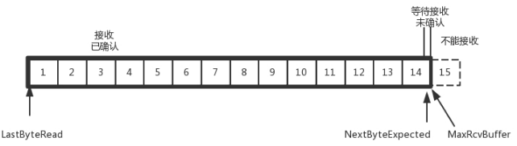

7. 当这个窗口通过包14的确认到达发送端的时候，发送端的窗口也调整为+0，停止发送  
   如果这样的话，发送方会定时发送窗口探测数据包，看是否有机会调整窗口的大小  
  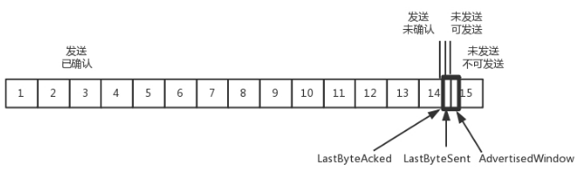
  当接收方比较慢的时候，要防止低能窗口综合征，别空出一个字节来就赶快告诉发送方，然后马上又填满了，可以当窗口太小的时候，不更新窗口，直到达到一定大小，或者缓冲区一半为空，才更新窗口

### 拥塞控制

拥塞控制也是通过窗口的大小来控制的，前面的滑动窗口rwnd(receiver window)是怕发送方把接收方缓存塞满，而拥塞窗口cwnd(congestion window)是怕把网络塞满。这里有一个公式 LastByteSent - LastByteAcked <= min(cwnd, rwnd)，是拥塞窗口和滑动窗口共同控制发送的速度。TCP的拥塞控制就是在不堵塞，不丢包的情况下，尽量发挥带宽

如下图所示，假设往返时间为8s，去4s，回4s，每秒发送一个包，每个包1024byte。已经过去了8s，则8个包都发出去了，其中前4个包已经到达接收端，但是ACK还没有返回，不能算发送成功。5-8后四个包还在路上，还没被接收。这个时候，整个管道正好撑满，在发送端，已发送未确认的为8个包，正好等于带宽，也即每秒发送1个包，乘以来回时间8s
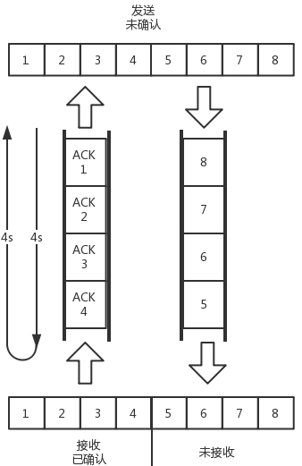

__如果我们在这个基础上再调大窗口，使得单位时间内更多的包可以发送，会出现什么现象呢？__  

* 如果发送的更加快速则单位时间内会有更多的包到达这些中间设备，这些设备还是只能每秒处理一个包，多出来的包就会**被丢弃**，这是我们不想看到的

* 这个时候，我们可以想其他的办法，例如这个四个设备本来每秒处理一个包，但是我们在这些设备上加缓存，处理不过来的在队列里面排着，这样包就不会丢失，但是缺点是会增加时延，这个缓存的包，4s肯定到达不了接收端了，如果时延达到一定程度，就会**超时重传**，也是我们不想看到的

__TCP的拥塞控制主要来避免两种现象:包丢失和超时重传__

一旦出现丢包或者超时重传就说明发送速度太快了，要慢一点。但是一开始怎么知道速度多快呢，怎么知道应该把窗口调整到多大呢？**TCP的慢启动**！开始只能发一个包，2个，4个，8个，越来越多知道满了。因为流量控制和拥塞控制是控制同一个窗口，所以起始的流量窗口也是1

* 一条TCP连接开始，cwnd设置为一个报文段，一次只能发送一个；

* 当收到这一个确认的时候，cwnd加一，于是一次能够发送两个；

* 当这两个的确认到来的时候，每个确认cwnd加一，两个确认cwnd加二，于是一次能够发送四个；

* 当这四个的确认到来的时候，每个确认cwnd加一，四个确认cwnd加四，于是一次能够发送八个。
        
可以看出这是指数性的增长。涨到什么时候是个头呢？有一个值ssthresh(slow start threshold)为65535个字节(64k)，当超过这个值的时候，不能倒这么快了，可能快满了，再慢下来

* 每收到一个确认后，cwnd增加1/cwnd，我们接着上面的过程来

* 一次发送八个，当八个确认到来的时候，每个确认增加1/8，八个确认一共cwnd增加1, 于是一次能够发送九个

* **变成了线性增长。但是线性增长还是增长，还是越来越多，直到出现了拥塞，这时候一般就会一下子降低发送的速度，等待接收端慢慢接收**

拥塞的一种表现形式是丢包，需要超时重传，这个时候，将sshthresh设为cwnd/2，将cwnd设为1，重新开始慢启动。这真是一旦超时重传，马上回到解放前。但是这种方式太激进了，将一个高速的传输速度一下子停了下来，会造成网络卡顿

* 快速重传算法。当接收端发现丢了一个中间包的时候，发送三次前一个包的ACK，于是发送端就会快速的重传，不必等待超时再重传。TCP认为这种情况不严重，因为大部分没丢，只丢了一小部分，cwnd减半为cwnd/2，然后sshthresh = cwnd。当三个包返回的时候，cwnd = sshthresh+3，也就是没有一夜回到解放前，而是还在比较高的值，呈线性增长

* 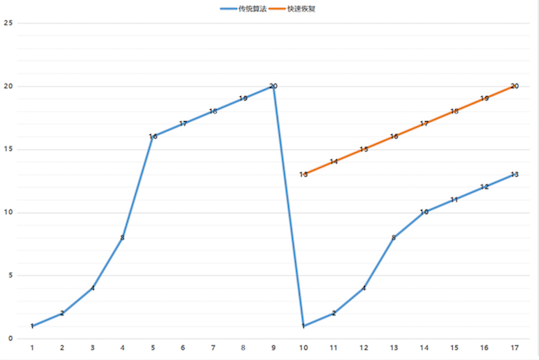

__上边其实还有两个问题__

* 第一个问题是丢包并不代表着通道满了，例如公网上带宽不满也会丢包，这个时候就认为拥塞了，退缩了，其实是不对的

* 第二个问题是TCP的拥塞控制要等到将中间设备都填充满了，才发生丢包，从而降低速度，这时候已经晚了。其实TCP只要填满管道就可以了，不应该接着填，直到连缓存也填满

为了优化这两个问题，后来有了TCP BBR拥塞算法 (Bottleneck Bandwidth and Round-trip propagation time)

* 它企图找到一个平衡点，就是通过不断的加快发送速度，将管道填满，但是不要填满中间设备的缓存，因为这样时延会增加，在这个平衡点可以很好的达到高带宽和低时延的平衡

* 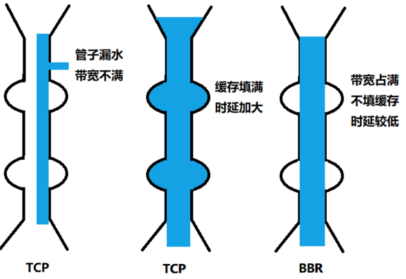

