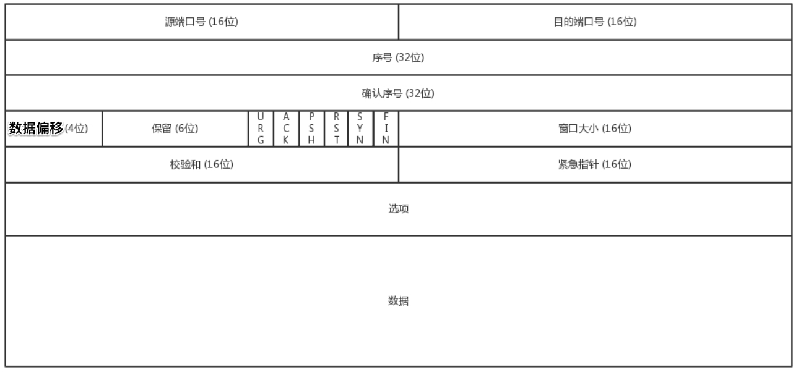

TCP是靠谱的协议，但是这不能说明它面临的网络环境好。从IP层面来讲，如果网络状况的确那么差，是没有任何可靠性保证的。而作为IP的上一层TCP也无能为力，唯一能做的就是更加努力，不断重传，通过各种算法保证。也就是说，对于TCP来讲，IP层你丢不丢包，我管不着，但是我在我的层面上，会努力保证可靠性

__tcp包格式__

* 序号：是为了解决乱序的问题，一次TCP通信过程中某一个传输方向上首字节的编号，通过这个来确认发送的数据有序，比如现在序列号为1000，发送了1000个字节，下一个序列号就是2000，接收方需要根据需要来排序的，不编好号没法确认哪个应该先来，哪个应该后到

* 确认序号：这个可以解决不丢包的问题，发出去的包应该有确认，要不然我怎么知道对方有没有收到，如果没有收到就应该重新发送，直到送达。确认号为上一个对方发送过来的数据包中的序列号+字节的长度

* 数据偏移：tcp包里边应该往后偏移多少个32位表示数据部分，也就是tcp头部长度。1代表32bit，2代表64bit。一共4位最大为15，15×32=480b=60B，所以头部最大为60个字节，最小为20字节

* 保留：保留字段，未使用

* 状态位： 例如SYN是发起一个连接，ACK是回复，RST是重新连接，FIN是结束连接，URG是紧急指针，PSH是推送标志。TCP是面向连接的，因而双方要维护连接的状态，这些带状态位的包的发送，会引起双方的状态变更

* 窗口大小：TCP要做流量控制，通信双方各声明一个窗口，标识自己当前能够的处理能力，别发送的太快，撑死我，也别发的太慢，饿死我。接收方处理能力和网络情况共同决定窗口大小

* 校验和：此字段用来校验数据是否出错，接收端对报文段执行CRC算法以检验TCP报文段在传输中是否损坏

* 紧急指针：用于发送紧急数据的情况，指向后面是优先数据的字节，在URG标志设置了时才有效。如果URG标志没有被设置，紧急域作为填充

* 选项：TCP头部的长度可以变化，因此可以承载更多的数据。注意这里必须使用32位的数据，用来快速定位数据部分的位置，所以没有那么多数据的话需要在后面进行填充。这里与数据偏移字段相关联，这样就可以知道头部的长度以及数据部分的准确位置

__三次握手__

* 

* 为什么需要3次而不是2次或者4次：

  * A发起一个连接，当第一个请求杳无音信的时候会有很多的可能性，比如请求包丢了，再如没有丢但绕了弯路超时了，还有B没有响应不想和我连接，A不能确认结果，于是再发，再发。终于，有一个请求包到了B，但是请求包到了B的这个事情，目前A还是不知道的，A还有可能再发
   
  * B收到了请求包，就知道A的存在，并且知道A要和它建立连接。如果B不乐意建立连接，则A会重试一阵后放弃，连接建立失败，没有问题；如果B是乐意建立连接的，则会发送应答包给A

  * 当然对与B来说，这个应答包也是一入网络深似海，不知道能不能到达A，这个时候B自然不能认为连接是建立好了，因为应答包仍然会丢，会绕弯路，或者A已经挂了都有可能。而且这个时候B还能碰到一个诡异的现象就是，A和B原来建立了连接，做了简单通信后，结束了连接，A建立连接的时候，请求包重复发了几次，有的请求包绕了一大圈又回来了，B会认为这也是一个正常的的请求的话，因此建立了连接，可以想象，这个连接不会进行下去，也没有个终结的时候，纯属单相思了。因而两次握手肯定不行

  * B发送的应答可能会发送多次，但是只要一次到达A，A就认为连接已经建立了，因为对于A来讲，他的消息有去有回。A会给B发送应答之应答，而B也在等这个消息，才能确认连接的建立，只有等到了这个消息，对于B来讲，才算它的消息有去有回

  * 当然A发给B的应答之应答也会丢，也会绕路，甚至B挂了。按理来说，还应该有个应答之应答之应答，这样下去就没底了。所以四次握手是可以的，四十次都可以，关键四百次也不能保证就真的可靠了。只要双方的消息都有去有回，就基本可以了

  * 大部分情况下，A和B建立了连接之后，A会马上发送数据的，一旦A发送数据，则很多问题都得到了解决。例如A发给B的应答丢了，当A后续发送的数据到达的时候，B可以认为这个连接已经建立，或者B压根就挂了，A发送的数据会报错，说B不可达，A就知道B出事情了

  * 当然你可以说A比较坏，就是不发数据建立连接后空着。我们在程序设计的时候，可以要求开启keepalive机制，即使没有真实的数据包也有探活包。你作为服务端B的程序设计者，对于A这种长时间不发包的客户端，可以主动关闭，从而空出资源来给其他客户端使用（可以设置长连接的最大空闲时间）

* 三次握手还可以用来协商TCP包序号
tcp头部的序号往往都不是从1开始的，因为这样往往会出现冲突。例如，A连上B之后，发送了1、2、3三个包，但是发送3的时候，中间丢了，或者绕路了，于是重新发送，后来A掉线了，重新连上B后，序号又从1开始，然后发送2，但是压根没想发送3，但是上次绕路的那个3又回来了，发给了B，B自然认为，这就是下一个包，于是发生了错误。因而，每个连接都要有不同的序号，这个序号的起始序号是随着时间变化的，可以看成一个32位的计数器，每4微妙加一，计算一下，如果到重复，需要4个多小时，那个绕路的包早就死翘翘了，超过MSL

__四次挥手__

* 

* 当A说 FIN 就进入 FIN_WAIT_1 状态，B收到A的 FIN 消息后，回复 ACK 就进入 CLOSE_WAIT 状态

* A收到B的 ACK 就进入 FIN_WAIT_2 状态，如果这个时候B直接跑路，则A将永远在这个状态，TCP协议里面并没有对这个状态的处理，但是Linux有，可以调整tcp_fin_timeout这个参数，设置一个超时时间

* 如果B没有跑路，处理完自己的事发送了 FIN 的到A结束自己的CLOSED_WAIT状态，A发送B的FIN的ACK后，从 FIN_WAIT_2 状态结束。按说A可以跑路了，但是最后的这个ACK万一B收不到呢？则B会重新发一个FIN，这个时候A已经跑路了的话，B就再也收不到ACK了，因而TCP协议要求A最后等待一段时间TIME_WAIT，这个时间要足够长，长到如果B没收到ACK的话，“B的FIN”会重发的，A会重新发ACK。A在FIN_WAIT2直接跑路还有一个问题是，A的端口就直接空出来了，但是B不知道，B原来发过的很多包很可能还在路上，如果A的端口被一个新的应用占用了，这个新的应用会收到上个连接中B发过来的包，虽然序列号是重新生成的，但是这里要上一个双保险，防止产生混乱，因而也需要等足够长的时间，等到原来B发送的所有的包都死翘翘，再空出端口来。(服务大量的time_wait一般是短连造成的，主要是client)。不过在实际应用中可以通过设置 SO_REUSEADDR选项达到不必等待2MSL时间结束再使用此端口

* 等待的时间设为2MSL，MSL是Maximum Segment Lifetime，报文最大生存时间，它是任何报文在网络上存在的最长时间，超过这个时间报文将被丢弃，2MSL就是一个发送和一个回复所需的最大时间。 在Client发送出最后的ACK回复，但该ACK可能丢失，Server如果没有收到ACK，将不断重复发送FIN片段，所以Client不能立即关闭，它必须确认Server接收到了该ACK。Client会在发送出ACK之后进入到TIME_WAIT状态然后会设置一个计时器，等待2MSL的时间。如果在该时间内再次收到FIN，那么Client会重发ACK并再次等待2MSL，直到2MSL，Client都没有再次收到FIN，那么Client推断ACK已经被成功接收，则结束TCP连接。协议规定MSL为2分钟，实际应用中常用的是30秒或者1分钟

__TCP状态机__

