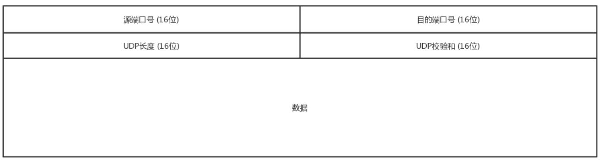

__udp包头__

__udp的特点__

* 沟通简单, 不需要大量的数据结构、处理逻辑、包头字段等, 前提是它相信网络世界是美好的, 相信网络通路默认就是很容易送达的不容易被丢弃

* 它不会建立连接, 虽然有端口号但是监听在这个地方, 谁都可以传给他数据, 他也可以传给任何人数据, 甚至可以同时传给多个人数据

* 它不会根据网络的情况进行发包的拥塞控制, 无论网络丢包丢成啥样了, 它该怎么发还怎么发

* udp一个包是一个请求, 每个都是完整的, 不用排序. 如果非得要排就需要应用层自己来排序了

__udp应用场景__

* 需要资源少, 在网络情况比较好的内网或者对于丢包不敏感的应用, 比如我们的各种数据上报

* 不需要一对一沟通建立连接, 而是可以广播的, 应用udp的不面向连接的功能可以承载广播或者多播的协议. DHCP就是一种广播的形式, 就是基于udp协议的

* 需要处理速度快、时延低, 可以容忍少数丢包, 但是要求即便网络拥塞, 也毫不退缩, 一往无前的时候

__udp和tcp的不同__

* tcp保证可靠交付, 通过tcp连接传输的数据无差错、不丢失、不重复、并且按序到达

* ip包是没有任何可靠性保证的, 一旦发出去都只能随它去, udp继承了ip包的特性, 不保证不丢失, 不保证按顺序到达
 
* tcp是面向字节流的. 发送的时候发的是一个流, 没头没尾. 对于应用层来说透明的可能就是一个send/recv函数但是在tcp层他会拆分或者合并为流进行传输. ip包可不是一个流, 而是一个个的ip包, 之所以变成了流, 这也是tcp自己的状态维护做的事情. 而udp继承了ip的特性, 基于数据报的, 一个一个地发, 一个一个地收

* tcp是有拥塞控制的, 它意识到包丢弃了或者网络的环境不好了, 就会根据情况调整自己的行为, 看看是不是发快了要不要发慢点. udp就不会, 应用让我发我就发, 管它洪水滔天

* tcp是一个有状态服务, 里面精确地记着发送了没有, 接收到没有, 发送到哪个了, 应该接收哪个了, 错一点儿都不行. 而udp则是无状态服务, 发出去就发出去了

