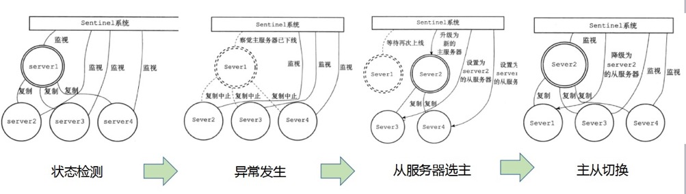

哨兵(sentinel) redis集群的管理工具, 是redis的高可用性解决方案, 由一个或多个sentinel 实例组成的 sentinel 集群可以监视任意多个主从服务器, 并在被监视的主服务器进入下线状态时, 自动将下线主服务器属下的某个从服务器升级为新的主服务器, 通过sentinel集群实现对redis的监控、通知、自动故障转移



__sentinel的作用__

* 监控(Monitoring): sentinel 会不断地检查你的主服务器和从服务器是否运作正常

* 提醒(Notification): 如果redis运行出现问题可以按照配置文件中的配置项通知客户端或者集群管理员

* 自动故障迁移(Automatic failover): 当一个主服务器不能正常工作时, sentinel 会开始一次自动故障迁移操作, 它会将失效主服务器的其中一个从服务器升级为新的主服务器, 并让失效主服务器的其他从服务器改为复制新的主服务器, 当客户端试图连接失效的主服务器时, 集群也会向客户端返回新主服务器的地址, 使得集群可以使用新主服务器代替失效服务器

__sentinel原理__

* sentinel 集群通过给定的配置文件发现 master, 启动时会监控 master, 通过向 master 发送 info 信息获得该服务器下面的所有从服务器

* 每个sentinel会以每两秒一次的频率通过发布与订阅功能向被它监视的所有主服务器和从服务器的 \_\_sentinel\_\_:hello 频道发送一条信息, 信息中包含了sentinel本身的 IP 地址、端口号和运行 ID(runid)及完整的主服务器当前配置, 以此来向其他 sentinel 宣告自己的存在

* 每个sentinel都订阅了被它监视的所有主服务器和从服务器的 \_\_sentinel\_\_:hello 频道, 接收其他 sentinel 发送的 hello 信息, 以此来发现监视同一个主服务器的其他 sentinel, 集群之间会互相创建命令连接用于通信, 因为已经有主从服务器作为发送和接收 hello 信息的中介, sentinel 之间不会创建订阅连接

* sentinel 集群使用 ping 命令来检测实例的状态, 如果在指定的时间内（down-after-milliseconds）没有回复或则返回错误的回复，那么该实例被判为主观下线(SDOWN)

* 被判主观下线后, failover 并不会马上进行, 还需要 sentinel 中的大多数 sentinel 授权后才可以进行 failover, 即进行 failover 的 sentinel 会去获得指定 quorum 个且绝大多数的 sentinel 的授权, 成功后进入客观下线(ODOWN)状态, 执行 failover

* sentinel 向选为 master 的 slave 发送 `SLAVEOF NO ONE` 命令. 选择 slave 的条件是 sentinel 首先会根据 slaves 的优先级来进行排序, 优先级越小排名越靠前, 如果优先级相同, 则查看复制的下标, 哪个从 master 接收的复制数据多哪个就靠前, 如果优先级和下标都相同, 就选择进程 ID 较小的

* sentinel 被授权后, 它将会获得宕掉的 master 的一份最新配置版本号(config-epoch), 当 failover 执行结束以后, 这个版本号将会被用于最新的配置, 通过广播形式通知其它 sentinel, 其它的 sentinel 则更新对应 master 的配置

* 1到3是自动发现机制, 4是检测机制, 5和6是failover机制, 7是更新配置机制

__sentinel配置__

```
# base
bind 127.0.0.1 192.168.1.1
protected-mode no
port 26379 
daemonize no
pidfile /var/run/redis-sentinel.pid
logfile  /var/run/redis-sentinel.log
dir /var/run/redis-sentinel

# monitor
sentinel monitor mymaster 127.0.0.1 6379 2
sentinel auth-pass mymaster MySUPER--secret-0123passw0rd
sentinel down-after-milliseconds mymaster 60000
sentinel failover-timeout mymaster 180000
sentinel parallel-syncs mymaster 1

sentinel monitor resque 192.168.1.3 6380 4
sentinel down-after-milliseconds resque 10000
sentinel failover-timeout resque 180000
sentinel parallel-syncs resque 5

# notification
# 通知脚本
sentinel notification-script mymaster /var/run/redis-sentinel/notify.sh

# 更新配置脚本
sentinel client-reconfig-script mymaster /var/redis/reconfig.sh

# 是否启用reconfig
sentinel deny-scripts-reconfig yes
```

* sentinel monitor mymaster 127.0.0.1 6379 2
sentinel去监视一个名为mymaster的主服务器, 这个主服务器的 IP 地址为 127.0.0.1, 端口号为 6379, 而将这个主服务器判断为失效至少需要 2 个 sentinel 同意, 【并且一个sentinel都需要获得系统中多数sentinel的支持才能发起一次自动故障迁移, 否则自动故障迁移就不会执行】

* sentinel auth-pass mymaster MySUPER--secret-0123passw0rd
设置mymaster的密码, 用于访问master和主从同步

* sentinel down-after-milliseconds mymaster 60000
指定了 Sentinel 认为服务器已经断线所需的毫秒数, 如果服务器在给定的毫秒数之内没有返回 sentinel 发送的 PING 命令的回复, 或者返回一个错误, 那么 sentinel 将这个服务器标记为主观下线

* sentinel parallel-syncs mymaster 5
在对mymaster执行故障转移时, 最多可以有5个从服务器同时对新的主服务器进行同步, 这个数字越小, 完成故障转移所需的时间就越长. 
你可能不希望所有从服务器都在同一时间向新的主服务器发送同步请求, 因为尽管复制过程的绝大部分步骤都不会阻塞从服务器, 但从服务器在载入主服务器发来的 RDB 文件时, 仍然会造成从服务器在一段时间内不能处理命令请求, 如果全部从服务器一起对新的主服务器进行同步, 那么就可能会造成所有从服务器在短时间内全部不可用的情况出现, 
可以通过将这个值设为 1 来保证每次只有一个从服务器处于不能处理命令请求的状态

* sentinel failover-timeout mymaster 180000
故障转移的超时时间, 四个作用
  * 同一个sentinel对同一个master两次failover之间的间隔时间
  * 当一个slave从一个错误的master那里同步数据开始计算时间, 直到slave被纠正为向正确的master那里同步数据时
  * 当想要取消一个正在进行的failover所需要的时间
  * 当进行failover时, 配置所有slaves指向新的master所需的最大时间, 不过即使过了这个超时slaves依然会被正确配置为指向master, 但是就不按parallel-syncs所配置的规则来了

__主观下线 && 客观下线__

* 主观下线 subjectively down, 简称 SDOWN
如果实例在down-after-milliseconds设置的时间(毫秒)内没有有效响应或者响应无效, 则标识这个实例已经进入主观下线状态

* 客观下线 objectively down, 简称 ODOWN
当sentinel将一个master判断为主观下线之后, 为了确定这个master是否真的下线了, 它会向同样监视这个master的其它sentinel进行询问, 看它们是否也认为master已经进入下线状态(可以是主观下线也可以是客观下线). 当sentinel从其它sentinel那里接收到足够数量的(quorum)已下线判断之后, 则标识这个实例已经进入可观下线状态并执行故障转移  

* 服务器对 PING 命令的有效回复可以是以下三种回复的其中一种
  * 返回 +PONG
  * 返回 -LOADING 错误
  * 返回 -MASTERDOWN 错误

* 一个服务器必须在 master-down-after-milliseconds 毫秒内, 一直返回无效回复才会被 sentinel 标记为主观下线. 举个例子, 如果 master-down-after-milliseconds 选项的值为30000毫秒(30秒), 那么只要服务器能在每 29 秒之内返回至少一次有效回复, 这个服务器就仍然会被认为是处于正常状态的

* 客观下线条件只适用于主服务器： 对于任何其他类型的 redis 实例， sentinel 在将它们判断为下线前不需要进行协商， 所以从服务器或者其他 sentinel 永远不会达到客观下线条件。

* 只要一个 sentinel 发现某个主服务器进入了客观下线状态， 这个 sentinel 就可能会被其他 sentinel 推选出， 并对失效的主服务器执行自动故障迁移操作。

* 从主观下线状态切换到客观下线状态并没有使用严格的共识算法, 而是使用了gossip协议, 如果 sentinel 在给定的时间范围内, 从其他 sentinel 那里接收到了足够数量的主服务器下线报告, 那么 sentinel 就会将主服务器的状态从主观下线改变为客观下线. 如果之后其他 sentinel 不再报告主服务器已下线, 那么客观下线状态就会被移除

__sentinel的弊端__

* 一般情况下, 至少会需要三个哨兵对redis 进行监控, 可以避免脑裂

* sentinel 仅仅解决了高可用的问题, 对于主节点单点写入和单节点无法扩容等问题还需要引入 集群模式 予以解决

* sentinel + redis分布式系统不保证在故障期间保留已确认的写入, 因为redis使用异步复制. 目前只能通过min-slaves-to-write N 和 min-slaves-max-lag N 两个配置降低丢失的程度

__参考__

* https://redis.io/topics/sentinel

* https://godoc.org/github.com/go-redis/redis#NewFailoverClient
